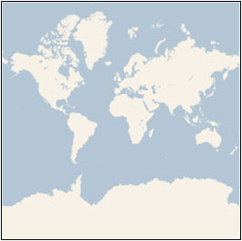
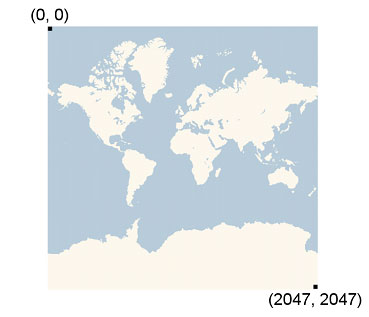
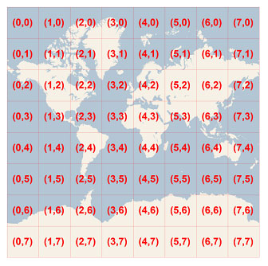
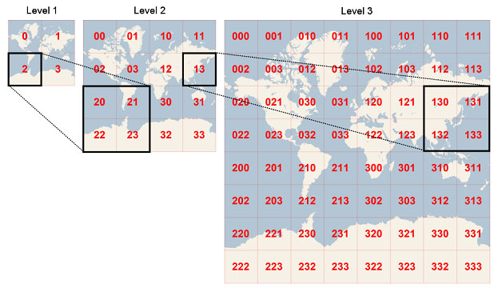

# Bing Maps Tile System
Bing Maps provides a world map that users can directly manipulate to pan and zoom.  To make this interaction as fast and responsive as possible, we chose to pre-render the map at many different levels of detail, and to cut each map into tiles for quick retrieval and display.  This document describes the projection, coordinate systems, and addressing scheme of the map tiles, which collectively are called the Bing Maps Tile System.  
  
## Map Projection  
 To make the map seamless, and to ensure that aerial images from different sources line up properly, we have to use a single projection for the entire world.  We chose to use the **Mercator projection**, which looks like this:  
  
   
  
 Although the Mercator projection significantly distorts scale and area (particularly near the poles), it has two important properties that outweigh the scale distortion:  
  
1.  It’s a **conformal** projection, which means that it preserves the shape of relatively small objects.  This is especially important when showing aerial imagery, because we want to avoid distorting the shape of buildings.  Square buildings should appear square, not rectangular.  
  
2.  It’s a **cylindrical** projection, which means that north and south are always straight up and down, and west and east are always straight left and right.  
  
 Since the Mercator projection goes to infinity at the poles, it doesn’t actually show the entire world.  Using a square aspect ratio for the map, the maximum latitude shown is approximately 85.05 degrees.  
  
 To simplify the calculations, we use the spherical form of this projection, not the ellipsoidal form.  Since the projection is used only for map display, and not for displaying numeric coordinates, we don’t need the extra precision of an ellipsoidal projection.  The spherical projection causes approximately 0.33% scale distortion in the Y direction, which is not visually noticeable.  
  
### Ground Resolution and Map Scale  
 In addition to the projection, the ground resolution or map scale must be specified in order to render a map.  At the lowest level of detail (Level 1), the map is 512 x 512 pixels.  At each successive level of detail, the map width and height grow by a factor of 2:  Level 2 is 1024 x 1024 pixels, Level 3 is 2048 x 2048 pixels, Level 4 is 4096 x 4096 pixels, and so on.  In general, the width and height of the map (in pixels) can be calculated as:  
  
 `map width = map height = 256 * 2` <sup>level</sup>  `pixels`  
  
 The **ground resolution** indicates the distance on the ground that’s represented by a single pixel in the map.  For example, at a ground resolution of 10 meters/pixel, each pixel represents a ground distance of 10 meters.  The ground resolution varies depending on the level of detail and the latitude at which it’s measured.  Using an earth radius of 6378137 meters, the ground resolution (in meters per pixel) can be calculated as:  
  
 `ground resolution = cos(latitude * pi/180) * earth circumference / map width`  
  
 `= (cos(latitude * pi/180) * 2 * pi * 6378137 meters) / (256 * 2` <sup>level</sup>  `pixels)`  
  
 The **map scale** indicates the ratio between map distance and ground distance, when measured in the same units.  For instance, at a map scale of 1 : 100,000, each inch on the map represents a ground distance of 100,000 inches.  Like the ground resolution, the map scale varies with the level of detail and the latitude of measurement.  It can be calculated from the ground resolution as follows, given the screen resolution in dots per inch, typically 96 dpi:  
  
 `map scale = 1 : ground resolution * screen dpi / 0.0254 meters/inch`  
  
 `= 1 : (cos(latitude * pi/180) * 2 * pi * 6378137 * screen dpi) / (256 * 2` <sup>level</sup>  `* 0.0254)`  
  
 This table shows each of these values at each level of detail, **as measured at the Equator**.  (Note that the ground resolution and map scale also vary with the latitude, as shown in the equations above, but not shown in the table below.)  
  
|||||  
|-|-|-|-|  
|**Level of Detail**|**Map Width and Height (pixels)**|**Ground Resolution (meters / pixel)**|**Map Scale** <br />**(at 96 dpi)**|  
|1|512|78,271.5170|1 : 295,829,355.45|  
|2|1,024|39,135.7585|1 : 147,914,677.73|  
|3|2,048|19,567.8792|1 : 73,957,338.86|  
|4|4,096|9,783.9396|1 : 36,978,669.43|  
|5|8,192|4,891.9698|1 : 18,489,334.72|  
|6|16,384|2,445.9849|1 : 9,244,667.36|  
|7|32,768|1,222.9925|1 : 4,622,333.68|  
|8|65,536|611.4962|1 : 2,311,166.84|  
|9|131,072|305.7481|1 : 1,155,583.42|  
|10|262,144|152.8741|1 : 577,791.71|  
|11|524,288|76.4370|1 : 288,895.85|  
|12|1,048,576|38.2185|1 : 144,447.93|  
|13|2,097,152|19.1093|1 : 72,223.96|  
|14|4,194,304|9.5546|1 : 36,111.98|  
|15|8,388,608|4.7773|1 : 18,055.99|  
|16|16,777,216|2.3887|1 : 9,028.00|  
|17|33,554,432|1.1943|1 : 4,514.00|  
|18|67,108,864|0.5972|1 : 2,257.00|  
|19|134,217,728|0.2986|1 : 1,128.50|  
|20|268,435,456|0.1493|1 : 564.25|  
|21|536,870,912|0.0746|1 : 282.12|  
|22|1,073,741,824|0.0373|1 : 141.06|  
|23|2,147,483,648|0.0187|1 : 70.53|  
  
### Pixel Coordinates  
 Having chosen the projection and scale to use at each level of detail, we can convert geographic coordinates into pixel coordinates.  Since the map width and height is different at each level, so are the pixel coordinates.  The pixel at the upper-left corner of the map always has pixel coordinates (0, 0).  The pixel at the lower-right corner of the map has pixel coordinates (width-1, height-1), or referring to the equations in the previous section, (256 * 2<sup>level</sup>–1, 256 * 2<sup>level</sup>–1).  For example, at level 3, the pixel coordinates range from (0, 0) to (2047, 2047), like this:  
  
   
  
 Given latitude and longitude in degrees, and the level of detail, the pixel XY coordinates can be calculated as follows:  
  
 `sinLatitude = sin(latitude * pi/180)`  
  
 `pixelX = ((longitude + 180) / 360) * 256 * 2` <sup>level</sup>  
  
 `pixelY = (0.5 – log((1 + sinLatitude) / (1 – sinLatitude)) / (4 * pi)) * 256 * 2` <sup>level</sup>  
  
 The latitude and longitude are assumed to be on the WGS 84 datum.  Even though Bing Maps uses a spherical projection, it’s important to convert all geographic coordinates into a common datum, and WGS 84 was chosen to be that datum.  The longitude is assumed to range from -180 to +180 degrees, and the latitude must be clipped to range from -85.05112878 to 85.05112878.  This avoids a singularity at the poles, and it causes the projected map to be square.  
  
### Tile Coordinates and Quadkeys  
 To optimize the performance of map retrieval and display, the rendered map is cut into tiles of 256 x 256 pixels each.  As the number of pixels differs at each level of detail, so does the number of tiles:  
  
 `map width = map height = 2` <sup>level</sup> `tiles`  
  
 Each tile is given XY coordinates ranging from (0, 0) in the upper left to (2<sup>level</sup>–1, 2<sup>level</sup>–1) in the lower right.  For example, at level 3 the tile coordinates range from (0, 0) to (7, 7) as follows:  
  
   
  
 Given a pair of pixel XY coordinates, you can easily determine the tile XY coordinates of the tile containing that pixel:  
  
 `tileX = floor(pixelX / 256)`  
  
 `tileY = floor(pixelY / 256)`  
  
 To optimize the indexing and storage of tiles, the two-dimensional tile XY coordinates are combined into one-dimensional strings called quadtree keys, or “quadkeys” for short.  Each quadkey uniquely identifies a single tile at a particular level of detail, and it can be used as an key in common database B-tree indexes.  To convert tile coordinates into a quadkey, the bits of the Y and X coordinates are interleaved, and the result is interpreted as a base-4 number (with leading zeros maintained) and converted into a string.  For instance, given tile XY coordinates of (3, 5) at level 3, the quadkey is determined as follows:  
  
 `tileX = 3 = 011`2  
  
 `tileY = 5 = 101`2  
  
 `quadkey = 100111`2`= 213`4`= “213”`  
  
 Quadkeys have several interesting properties.  First, the length of a quadkey (the number of digits) equals the level of detail of the corresponding tile.  Second, the quadkey of any tile starts with the quadkey of its parent tile (the containing tile at the previous level).  As shown in the example below,  tile 2 is the parent of tiles 20 through 23, and tile 13 is the parent of tiles 130 through 133:  
  
   
  
 Finally, quadkeys provide a one-dimensional index key that usually preserves the proximity of tiles in XY space.  In other words, two tiles that have nearby XY coordinates usually have quadkeys that are relatively close together.  This is important for optimizing database performance, because neighboring tiles are usually requested in groups, and it’s desirable to keep those tiles on the same disk blocks, in order to minimize the number of disk reads.  
  
### Sample Code  
 The following sample C# code illustrates how to implement the functions described in this document.  These functions can be easily translated into other programming languages as needed.  
  
```  
  
//------------------------------------------------------------------------------  
// <copyright company="Microsoft">  
//     Copyright (c) 2006-2009 Microsoft Corporation.  All rights reserved.  
// </copyright>  
//------------------------------------------------------------------------------  
  
using System;  
using System.Text;  
  
namespace Microsoft.MapPoint  
{  
    static class TileSystem  
    {  
        private const double EarthRadius = 6378137;  
        private const double MinLatitude = -85.05112878;  
        private const double MaxLatitude = 85.05112878;  
        private const double MinLongitude = -180;  
        private const double MaxLongitude = 180;  
  
        /// <summary>  
        /// Clips a number to the specified minimum and maximum values.  
        /// </summary>  
        /// <param name="n">The number to clip.</param>  
        /// <param name="minValue">Minimum allowable value.</param>  
        /// <param name="maxValue">Maximum allowable value.</param>  
        /// <returns>The clipped value.</returns>  
        private static double Clip(double n, double minValue, double maxValue)  
        {  
            return Math.Min(Math.Max(n, minValue), maxValue);  
        }  
  
        /// <summary>  
        /// Determines the map width and height (in pixels) at a specified level  
        /// of detail.  
        /// </summary>  
        /// <param name="levelOfDetail">Level of detail, from 1 (lowest detail)  
        /// to 23 (highest detail).</param>  
        /// <returns>The map width and height in pixels.</returns>  
        public static uint MapSize(int levelOfDetail)  
        {  
            return (uint) 256 << levelOfDetail;  
        }  
  
        /// <summary>  
        /// Determines the ground resolution (in meters per pixel) at a specified  
        /// latitude and level of detail.  
        /// </summary>  
        /// <param name="latitude">Latitude (in degrees) at which to measure the  
        /// ground resolution.</param>  
        /// <param name="levelOfDetail">Level of detail, from 1 (lowest detail)  
        /// to 23 (highest detail).</param>  
        /// <returns>The ground resolution, in meters per pixel.</returns>  
        public static double GroundResolution(double latitude, int levelOfDetail)  
        {  
            latitude = Clip(latitude, MinLatitude, MaxLatitude);  
            return Math.Cos(latitude * Math.PI / 180) * 2 * Math.PI * EarthRadius / MapSize(levelOfDetail);  
        }  
  
        /// <summary>  
        /// Determines the map scale at a specified latitude, level of detail,  
        /// and screen resolution.  
        /// </summary>  
        /// <param name="latitude">Latitude (in degrees) at which to measure the  
        /// map scale.</param>  
        /// <param name="levelOfDetail">Level of detail, from 1 (lowest detail)  
        /// to 23 (highest detail).</param>  
        /// <param name="screenDpi">Resolution of the screen, in dots per inch.</param>  
        /// <returns>The map scale, expressed as the denominator N of the ratio 1 : N.</returns>  
        public static double MapScale(double latitude, int levelOfDetail, int screenDpi)  
        {  
            return GroundResolution(latitude, levelOfDetail) * screenDpi / 0.0254;  
        }  
  
        /// <summary>  
        /// Converts a point from latitude/longitude WGS-84 coordinates (in degrees)  
        /// into pixel XY coordinates at a specified level of detail.  
        /// </summary>  
        /// <param name="latitude">Latitude of the point, in degrees.</param>  
        /// <param name="longitude">Longitude of the point, in degrees.</param>  
        /// <param name="levelOfDetail">Level of detail, from 1 (lowest detail)  
        /// to 23 (highest detail).</param>  
        /// <param name="pixelX">Output parameter receiving the X coordinate in pixels.</param>  
        /// <param name="pixelY">Output parameter receiving the Y coordinate in pixels.</param>  
        public static void LatLongToPixelXY(double latitude, double longitude, int levelOfDetail, out int pixelX, out int pixelY)  
        {  
            latitude = Clip(latitude, MinLatitude, MaxLatitude);  
            longitude = Clip(longitude, MinLongitude, MaxLongitude);  
  
            double x = (longitude + 180) / 360;   
            double sinLatitude = Math.Sin(latitude * Math.PI / 180);  
            double y = 0.5 - Math.Log((1 + sinLatitude) / (1 - sinLatitude)) / (4 * Math.PI);  
  
            uint mapSize = MapSize(levelOfDetail);  
            pixelX = (int) Clip(x * mapSize + 0.5, 0, mapSize - 1);  
            pixelY = (int) Clip(y * mapSize + 0.5, 0, mapSize - 1);  
        }  
  
        /// <summary>  
        /// Converts a pixel from pixel XY coordinates at a specified level of detail  
        /// into latitude/longitude WGS-84 coordinates (in degrees).  
        /// </summary>  
        /// <param name="pixelX">X coordinate of the point, in pixels.</param>  
        /// <param name="pixelY">Y coordinates of the point, in pixels.</param>  
        /// <param name="levelOfDetail">Level of detail, from 1 (lowest detail)  
        /// to 23 (highest detail).</param>  
        /// <param name="latitude">Output parameter receiving the latitude in degrees.</param>  
        /// <param name="longitude">Output parameter receiving the longitude in degrees.</param>  
        public static void PixelXYToLatLong(int pixelX, int pixelY, int levelOfDetail, out double latitude, out double longitude)  
        {  
            double mapSize = MapSize(levelOfDetail);  
            double x = (Clip(pixelX, 0, mapSize - 1) / mapSize) - 0.5;  
            double y = 0.5 - (Clip(pixelY, 0, mapSize - 1) / mapSize);  
  
            latitude = 90 - 360 * Math.Atan(Math.Exp(-y * 2 * Math.PI)) / Math.PI;  
            longitude = 360 * x;  
        }  
  
        /// <summary>  
        /// Converts pixel XY coordinates into tile XY coordinates of the tile containing  
        /// the specified pixel.  
        /// </summary>  
        /// <param name="pixelX">Pixel X coordinate.</param>  
        /// <param name="pixelY">Pixel Y coordinate.</param>  
        /// <param name="tileX">Output parameter receiving the tile X coordinate.</param>  
        /// <param name="tileY">Output parameter receiving the tile Y coordinate.</param>  
        public static void PixelXYToTileXY(int pixelX, int pixelY, out int tileX, out int tileY)  
        {  
            tileX = pixelX / 256;  
            tileY = pixelY / 256;  
        }  
  
        /// <summary>  
        /// Converts tile XY coordinates into pixel XY coordinates of the upper-left pixel  
        /// of the specified tile.  
        /// </summary>  
        /// <param name="tileX">Tile X coordinate.</param>  
        /// <param name="tileY">Tile Y coordinate.</param>  
        /// <param name="pixelX">Output parameter receiving the pixel X coordinate.</param>  
        /// <param name="pixelY">Output parameter receiving the pixel Y coordinate.</param>  
        public static void TileXYToPixelXY(int tileX, int tileY, out int pixelX, out int pixelY)  
        {  
            pixelX = tileX * 256;  
            pixelY = tileY * 256;  
        }  
  
        /// <summary>  
        /// Converts tile XY coordinates into a QuadKey at a specified level of detail.  
        /// </summary>  
        /// <param name="tileX">Tile X coordinate.</param>  
        /// <param name="tileY">Tile Y coordinate.</param>  
        /// <param name="levelOfDetail">Level of detail, from 1 (lowest detail)  
        /// to 23 (highest detail).</param>  
        /// <returns>A string containing the QuadKey.</returns>  
        public static string TileXYToQuadKey(int tileX, int tileY, int levelOfDetail)  
        {  
            StringBuilder quadKey = new StringBuilder();  
            for (int i = levelOfDetail; i > 0; i--)  
            {  
                char digit = '0';  
                int mask = 1 << (i - 1);  
                if ((tileX & mask) != 0)  
                {  
                    digit++;  
                }  
                if ((tileY & mask) != 0)  
                {  
                    digit++;  
                    digit++;  
                }  
                quadKey.Append(digit);  
            }  
            return quadKey.ToString();  
        }  
  
        /// <summary>  
        /// Converts a QuadKey into tile XY coordinates.  
        /// </summary>  
        /// <param name="quadKey">QuadKey of the tile.</param>  
        /// <param name="tileX">Output parameter receiving the tile X coordinate.</param>  
        /// <param name="tileY">Output parameter receiving the tile Y coordinate.</param>  
        /// <param name="levelOfDetail">Output parameter receiving the level of detail.</param>  
        public static void QuadKeyToTileXY(string quadKey, out int tileX, out int tileY, out int levelOfDetail)  
        {  
            tileX = tileY = 0;  
            levelOfDetail = quadKey.Length;  
            for (int i = levelOfDetail; i > 0; i--)  
            {  
                int mask = 1 << (i - 1);  
                switch (quadKey[levelOfDetail - i])  
                {  
                    case '0':  
                        break;  
  
                    case '1':  
                        tileX |= mask;  
                        break;  
  
                    case '2':  
                        tileY |= mask;  
                        break;  
  
                    case '3':  
                        tileX |= mask;  
                        tileY |= mask;  
                        break;  
  
                    default:  
                        throw new ArgumentException("Invalid QuadKey digit sequence.");  
                }  
            }  
        }  
    }  
}  
  
```  
  
### About the Author  
 Joe Schwartz is a software architect for Bing Maps.