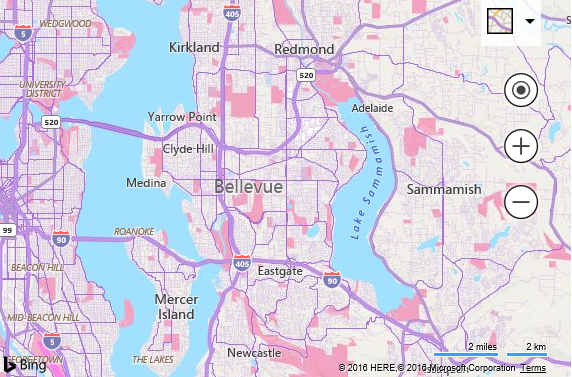
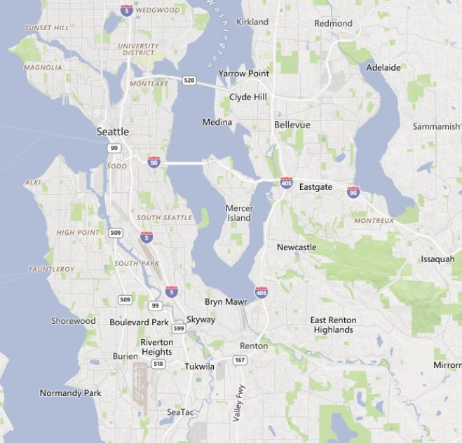

# Custom Map Styles in Bing Maps

Depending on which API or service you are using there are two different ways to specify a custom style in Bing Maps. The Bing Maps V8 web and Windows 10 UWP controls use a JSON style object, while the Bing Maps REST services and map tiles use a formatted string.

The JSON style schema is very comprehensive. The Windows 10 UWP map control makes full use of the schema while the Bing Maps V8 Web control and REST services support a subset of the schema. A JSON style created for the Windows 10 UWP map control will work with the V8 Web Control and vice-versa. Any unsupported style settings will simply be ignored.

This documentation will focus on custom map styles in Bing Maps V8 Web Control and the Bing Maps REST services. Documentation on using custom map styles in the Windows 10 UWP control can be found [here](https://docs.microsoft.com/en-us/uwp/api/windows.ui.xaml.controls.maps.mapstylesheet).

## Custom Map Styles in the Bing Maps V8 Web Control

The Bing Maps V8 control has a new map option called `customMapStyle` which can be set when loading the map. This property expects a JSON map **ICustomMapStyle** object. Here is an example of how to add a custom map style to Bing Maps V8.

```HTML
<!DOCTYPE html>
<html>
<head>
    <title></title>
    <meta charset="utf-8" />
    <script type='text/javascript'>
        var map;

        var myStyle = {
            "elements": {
                "water": { "fillColor": "#a1e0ff" },
                "waterPoint": { "iconColor": "#a1e0ff" },
                "transportation": { "strokeColor": "#aa6de0" },
                "road": { "fillColor": "#b892db" },
                "railway": { "strokeColor": "#a495b2" },
                "structure": { "fillColor": "#ffffff" },
                "runway": { "fillColor": "#ff7fed" },
                "area": { "fillColor": "#f39ebd" },
                "political": { "borderStrokeColor": "#fe6850", "borderOutlineColor": "#55ffff" },
                "point": { "iconColor": "#ffffff", "fillColor": "#FF6FA0", "strokeColor": "#DB4680" },
                "transit": { "fillColor": "#AA6DE0" }
            },
            "version": "1.0" 
        };

        function GetMap()
        {
            map = new Microsoft.Maps.Map('#myMap', {
                credentials: 'Your Bing Maps Key',
                customMapStyle: myStyle
            });
        }
    </script>
    <script type='text/javascript' src='http://www.bing.com/api/maps/mapcontrol?callback=GetMap' async defer></script>
</head>
<body>
    <div id="myMap"></div>
</body>
</html>
```

Running this code will produce a map that looks like this:



> **Tip:** TypeScript definitions for the Bing Maps V8 Web Control do include definitions for custom style schema. You can access the Bing Maps TypeScript definitions [here](https://github.com/Microsoft/Bing-Maps-V8-TypeScript-Definitions).

## Custom Map Styles in the REST and Tile Services

Custom map styles can be used with the Bing Maps REST imagery service and when [directly accessing Bing Maps tiles in a supported manner](../rest-services/directly-accessing-the-bing-maps-tiles.md). To add a custom map style, a formatted string version of the style can be added as a URL parameter to the image/tile request. The URL parameter that can be added to the request is `&style=` or `&st=`.

The style string has the following format:

> \[elementName\]|\[styleParam1\]:\[value\];\[styleParam2\]:\[value\];

The above format is for a single element in the custom map style. You can combine multiple elements and the settings value by joining them with an underscore (\_). The element name can either be the full element name (i.e. road) or the short form version (i.e. rd).

For example, take the following JSON style which colors water areas red and their labels green, makes roads blue, and sets the global land color to white:

```json
{
    "elements": {
        "water": {
            "fillColor": "#FF0000",
            "labelColor": "#00FF00"
        },
        "road": { "fillColor": "#0000FF" }
    },
    "settings": { "landColor": "#FFFFFF" },
    "version": "1.0"
}
```

The string formatted version of this style looks like this (long form):

```
water|fillColor:FF0000;labelColor:00FF00_road|fillColor:0000FF_global|landColor:FFFFFF 
```

Here is the same style using the short form version:

```
wt|fc:FF0000;lbc:00FF00_rd|fc:0000FF_g|landColor:FFFFFF
```

This can then be appended to a REST Static Image request or a tile URL. For example:

```
http://dev.virtualearth.net/REST/V1/Imagery/Map/Road/Bellevue%20Washington?&key=[YOUR_BING_MAPS_KEY]&st=wt|fc:FF0000;lbc:00FF00_rd|fc:0000FF_g|landColor:FFFFFF
```

Here is the image this request would return:


If the style is too long for a URL, when using the REST imagery service, the style can be passed in using a POST request. The POST data object format is: `style=[Your custom style]`

## Style Objects

The following defines the JSON objects that are used for creating custom map styles. All color values are specified as a hex **\#RRGGBB** or **\#AARRGGBB** string. When using the REST/Tile services, do not include hashtags.

> **Tip:** Ensure that all colors have 6 or 8 characters. If there is any other number of characters, the style will be considered invalid.

### ICustomMapStyle Object

The following properties are available in the custom map style object.

| Name     | URL Param | Type          | Description                             |
|----------|-----------|---------------|-----------------------------------------|
| elements |           | IMapElements  | A list of map elements to be styled.    |
| settings | g         | ISettingStyle | Global settings.                        |
| version  |           | string        | The version number of the style syntax. |

### IMapElements Object

The following is a list of map elements that can be styled to create a custom map style.

| Name                     | URL Param | Type                     | Description            |
|--------------------------|-----------|--------------------------|------------------------|
| adminDistrict            | ad        | IBorderedMapElementStyle | Admin1, state, province, etc. |
| adminDistrictCapital     | adc       | IMapElementStyle         | Icon representing the capital of a state/province.   |
| airport                  | ap        | IMapElementStyle         | Area of land encompassing an airport.   |
| area                     | ar        | IMapElementStyle         | Area of land use, not to be confused with Structure  |
| arterialRoad             | ard       | IMapElementStyle         | An arterial road is a high-capacity urban road. Its primary function is to deliver traffic from collector roads to freeways or expressways, and between urban centers efficiently. |
| building                 | bld       | IMapElementStyle         | A structure such as a house, store, factory.  |
| business                 | bs        | IMapElementStyle         | Restaurant, hospital, school, etc. |
| capital                  | cp        | IMapElementStyle         | Icon representing the capital populated place. |
| cemetery                 | cm        | IMapElementStyle         | Area of a cemetery       |
| continent                | ct        | IMapElementStyle         | Area of a whole continent |
| controlledAccessHighway  | cah       | IMapElementStyle         | A controlled-access highway is a type of road which has been designed for high-speed vehicular traffic, with all traffic flow and ingress/egress regulated. Also known as a highway, freeway, motorway, expressway, interstate, parkway, autobahn. |
| countryRegion            | cr        | IBorderedMapElementStyle | A country or independent sovereign state.|
| countryRegionCapital     | crc       | IMapElementStyle         | Icon representing the capital of a country/region. |
| district                 | ds        | IBorderedMapElementStyle | Admin2, county, etc. |
| education                | ed        | IMapElementStyle         | An area of land used for educational purposes such as a school campus. |
| educationBuilding        | eb        | IMapElementStyle         | A school or other educational building.|
| foodPoint                | fp        | IMapElementStyle         | Restaurant, café, etc. |
| forest                   | fr        | IMapElementStyle         | Area of forest land.  |
| golfCourse               | gc        | IMapElementStyle         | An area of land where the game of golf is played.  |
| highSpeedRamp            | hsrp      | IMapElementStyle         | Lines representing ramps typically alongside ControlledAccessHighways  |
| highway                  | hg        | IMapElementStyle         | All other highways other than controlled access highways. |
| indigenousPeoplesReserve | ipr       | IMapElementStyle         | An area of land reserved for Indigenous people. |
| island                   | is        | IMapElementStyle         | Labeling of area of an island. |
| majorRoad                | mr        | IMapElementStyle         | Major roads. |
| mapElement               | me        | IMapElementStyle         | The base map element in which all other map elements inherit from. |
| medical                  | md        | IMapElementStyle         | Area of land used for medical purposes. Generally, hospital campuses. |
| medicalBuilding          | mb        | IMapElementStyle         | A building which provides medical services. |
| military                 | ima       | IMapElementStyle         | A military area. |
| naturalPoint             | np        | IMapElementStyle         | A natural point of interest. |
| nautical                 | nt        | IMapElementStyle         | Area of land used for nautical purposes. |
| neighborhood             | nh        | IMapElementStyle         | Area defined as a neighborhood. |
| park                     | pr        | IMapElementStyle         | Area of any kind of park. |
| peak                     | pk        | IMapElementStyle         | Icon representing the peak of a mountain.|
| playingField             | pf        | IMapElementStyle         | Extracted pitches such as a baseball |
| point                    | pt        | IMapElementStyle         | All point features that are rendered with an icon of some sort. |
| pointOfInterest          | poi       | IMapElementStyle         | Restaurant, hospital, school, marina, ski area, etc. |
| political                | pl        | IBorderedMapElementStyle | A political border. |
| populatedPlace           | pp        | IMapElementStyle         | Icon representing size of populated place (city, town, etc).  |
| railway                  | rl        | IMapElementStyle         | Railway lines |
| ramp                     | rm        | IMapElementStyle         | Line representing the connecting entrance/exit to a highway. |
| reserve                  | rsv       | IMapElementStyle         | Area of nature reserve. |
| river                    | rv        | IMapElementStyle         | River, stream, or other passage. Note that this may be a line or polygon and may connect to non-river water bodies.  |
| road                     | rd        | IMapElementStyle         | Lines that represent all roads  |
| roadExit                 | re        | IMapElementStyle         | Icon representing the exit, typically from a controlled access highway. |
| runway                   | rw        | IMapElementStyle         | Land area covered by a runway. See also Airport for the land area of the whole airport. |
| sand                     | sn        | IMapElementStyle         | Area generally used for beaches but could be used for sandy areas/golf bunkers in the future.  |
| shoppingCenter           | sct       | IMapElementStyle         | A shopping center or mall. |
| stadium                  | sta       | IMapElementStyle         | Area of a stadium. |
| street                   | st        | IMapElementStyle         | A street.   |
| structure                | str       | IMapElementStyle         | Buildings and other building-like structures |
| tollRoad                 | tr        | IMapElementStyle         | A toll road. |
| trail                    | trl       | IMapElementStyle         | Walking trail, either through park or hiking trail  |
| transit                  | trn       | IMapElementStyle         | Icon representing a bus stop, train stop, airport, etc. |
| transitBuilding          | tb        | IMapElementStyle         | A transit building.  |
| transportation           | trs       | IMapElementStyle         | Lines that are part of the transportation network (roads, trains, ferries, etc.)  |
| unpavedStreet            | us        | IMapElementStyle         | An unpaved street.  |
| vegetation               | vg        | IMapElementStyle         | Forests, grassy areas, etc. |
| volcanicPeak             | vp        | IMapElementStyle         | Icon representing the peak of a volcano.  |
| water                    | wt        | IMapElementStyle         | Anything that looks like water.   |
| waterPoint               | wp        | IMapElementStyle         | Icon representing a water feature location such as a waterfall. |
| waterRoute               | wr        | IMapElementStyle         | Ferry route lines |

### IMapElementStyle Object

The following properties can be used when styling a map element.

| JSON Name         | URL Param | Type    | Description                          |
|-------------------|-----------|---------|--------------------------------------|
| fillColor         | fc        | string  | Color used for filling polygons, the background of point icons, and for the center of lines if they have split. |
| labelColor        | lbc       | string  | The color of a map label.  |
| labelOutlineColor | loc       | string  | The outline color of a map label.  |
| labelVisible      | lv        | boolean | Species if a map label type is visible or not. |
| strokeColor       | sc        | string  | Color used for the outline around polygons, the outline around point icons, and the color of lines.  |
| visible           | v         | boolean | Specifies if the map element is visible or not. |

### IBorderedMapElementStyle Object

Extends the IMapElementStyle object.

| JSON Name          | URL Param | Type    | Description                                                    |
|--------------------|-----------|---------|----------------------------------------------------------------|
| borderOutlineColor | boc       | string  | Secondary/casing line color of the border of a filled polygon. |
| borderStrokeColor  | bsc       | string  | Primary line color of the border of a filled polygon.          |
| borderVisible      | bv        | boolean | Specifies if a border is visible or not.                       |

### ISettingStyle Object

Defines the global settings that can be set.

| JSON Name           | URL Param | Type    | Description                        |
|---------------------|-----------|---------|------------------------------------|
| landColor           | lc        | string  | A color value that all land is first flushed to before things are drawn on it. |
| shadedReliefVisible |           | boolean | Specifies whether or not to draw elevation shading on the map. |

## Map Element Style Hierarchy

When styling map elements there is a hierarchy which can be used to apply styles at different levels. For example, if you wanted to make all roads red, you could go and style each road type, or you could simply apply the style to the road elements and all child elements would inherit that style. If you then wanted to only make toll roads green you could then add a style for that element and all other road types would continue to stay red.

Here is the map element hierarchy.

-   area
    -   airport
    -   cemetery
    -   continent
    -   education
    -   golfCourse
    -   indigenousPeoplesReserve
    -   island
    -   military
    -   medical
    -   nautical
    -   neighborhood
    -   runway
    -   sand
    -   shoppingCenter
    -   stadium
    -   vegetation
        -   forest
        -   park
        -   playingField
        -   reserve
-   point
    -   naturalPoint
        -   peak
            -   volcanicPeak
        -   waterPoint
    -   pointOfInterest
        -   business
            -   foodPoint
    -   populatedPlace
        -   capital
            -   adminDistrictCapital
            -   countryRegionCapital
    -   roadExit
    -   transit
-   political
    -   countryRegion
    -   adminDistrict
    -   district
-   structure
    -   building
        -   educationBuilding
        -   medicalBuilding
        -   transitBuilding
-   transportation
    -   road
        -   controlledAccessHighway
            -   highSpeedRamp
        -   highway
        -   majorRoad
        -   arterialRoad
        -   street
            -   ramp
        -   unpavedStreet
        -   tollRoad
    -   railway
    -   trail
    -   waterRoute
-   water
    -   river

## Known Limitation

The following are some known limitations of custom map styles.

-   Custom styles are not supported for all country maps. Custom maps styles require the use of vector map data. Some countries have strict regulations around vector map data which prevents the Bing Maps team from using it to create custom map styles on the fly. This effects China, South Korea, and Japan currently. If you zoom into one of these countries, you will see the default map tile style appear for these countries while surrounding areas will use the custom map style.

**Bing Maps V8**

-   If labels are styled, the map will go into `liteMode` as vector label styling is not currently supported.

**REST/Tile Services**

-   When using formatted string styles, do not end the style with a semi-colon (;).

-   When an invalid style is passed to the REST service, a blue image is returned.

## Custom Map Style Samples

Here are some sample custom map styles.

### Midnight Commander Style


```json
{
    "version": "1.0",
    "settings": {
        "landColor": "#0B334D"
    },
    "elements": {
        "mapElement": {
            "labelColor": "#FFFFFF",
            "labelOutlineColor": "#000000"
        },
        "political": {
            "borderStrokeColor": "#144B53",
            "borderOutlineColor": "#00000000"
        },
        "point": {
            "iconColor": "#0C4152",
            "fillColor": "#000000",
            "strokeColor": "#0C4152"
        },
        "transportation": {
            "strokeColor": "#000000",
            "fillColor": "#000000"
        },
        "highway": {
            "strokeColor": "#158399",
            "fillColor": "#000000"
        },
        "controlledAccessHighway": {
            "strokeColor": "#158399",
            "fillColor": "#000000"
        },
        "arterialRoad": {
            "strokeColor": "#157399",
            "fillColor": "#000000"
        },
        "majorRoad": {
            "strokeColor": "#157399",
            "fillColor": "#000000"
        },
        "railway": {
            "strokeColor": "#146474",
            "fillColor": "#000000"
        },
        "structure": {
            "fillColor": "#115166"
        },
        "water": {
            "fillColor": "#021019"
        },
        "area": {
            "fillColor": "#115166"
        }
    }
}
```

**REST Style**

```
me|lbc:ffffff;loc:000000_pl|bsc:144b53;boc:00000000_pt|ic:0c4152;fc:000000;sc:0c4152_trs|sc:000000;fc:000000_hg|sc:158399;fc:000000_cah|sc:158399;fc:000000_ard|sc:157399;fc:000000_mr|sc:157399;fc:000000_rl|sc:146474;fc:000000_str|fc:115166_wt|fc:021019_ar|fc:115166_g|lc:0b334d
```

### Countries Only Style


```json
{
    "version": "1.0",
    "elements": {
        "mapElement": {
            "labelVisible": false
        },
        "area": {
            "visible": false
        },
        "transportation": {
            "visible": false
        },
        "countryRegion": {
            "borderStrokeColor": "#444444",
            "borderOutlineColor": "#00000000",
            "fillColor": "#888888",
            "visible": true
        },
        "adminDistrict": {
            "borderVisible": false
        },
        "water": {
            "fillColor": "#FFFFFF"
        },
        "point": {
            "visible": false
        }
    }
}
```

**REST Style**

```
me|lv:0_ar|v:0_trs|v:0_cr|bsc:444444;boc:00000000;fc:888888;v:1_ad|bv:0_wt|fc:ffffff_pt|v:0
```

### Faded Map Style



```json
{
    "version": "1.0",
    "settings": {
        "landColor": "#e7e6e5",
        "shadedReliefVisible": false
    },
    "elements": {
        "vegetation": {
            "fillColor": "#c5dea2"
        },
        "naturalPoint": {
            "visible": false,
            "labelVisible": false
        },
        "transportation": {
            "labelOutlineColor": "#ffffff",
            "fillColor": "#ffffff",
            "strokeColor": "#d7d6d5"
        },
        "water": {
            "fillColor": "#b1bdd6",
            "labelColor": "#ffffff",
            "labelOutlineColor": "#9aa9ca"
        },
        "structure": {
            "fillColor": "#d7d6d5"
        },
        "indigenousPeoplesReserve": {
            "visible": false
        },
        "military": {
            "visible": false
        }
    }
}
```

**REST Style**

```
vg|fc:c5dea2_np|v:0;lv:0_trs|loc:ffffff;fc:ffffff;sc:d7d6d5_wt|fc:b1bdd6;lbc:ffffff;loc:9aa9ca_str|fc:d7d6d5_ipr|v:0_ima|v:0_g|lc:e7e6e5;srv:0
```

## Related Resources

* [Windows 10 UWP Map Control Custom Styles](https://docs.microsoft.com/en-us/uwp/api/windows.ui.xaml.controls.maps.mapstylesheet).
* [Load Map with Custom Style Sample](https://bingmapsv8samples.azurewebsites.net/#Load%20Map%20with%20Custom%20Style)
* [Simple Style Editor](https://bingmapsv8samples.azurewebsites.net/#Simple%20Style%20Editor)
