# Get a Static Map

Use the following URL templates to get a static map. You can also display a route on a static map, and you can request static map metadata. Static map metadata includes the absolute (latitude and longitude) and relative (with respect to the map) coordinates and size of pushpins as well as the map area and center point.

 The default map size is 350 pixels by 350 pixels.

> [!TIP] 
>
> **Static map metadata**: To get the size and center point of the image and the locations and size of the pushpins on the map, set the `mapMetadata` parameter to `1 ` (true). When you request static map metadata, the metadata is returned instead of the map image.  
 
  
## URL Templates

> [!NOTE]
>  These templates support both HTTP and HTTPS protocols.  
   
### Get a map that is centered at a specified point
  
 When you specify a center point, you must also specify a zoom level.  
  
```url 
https://dev.virtualearth.net/REST/v1/Imagery/Map/imagerySet/centerPoint/zoomLevel?mapSize={mapSize}&pushpin={pushpin}&mapLayer={mapLayer}&format={format}&mapMetadata={mapMetadata}&key={BingMapsAPIKey}
```  
  
### Get a map that shows a specified map area
  
```url
https://dev.virtualearth.net/REST/v1/Imagery/Map/imagerySet?mapArea={mapArea}&mapSize={mapSize}&pushpin={pushpin}&mapLayer={mapLayer}&format={format}&mapMetadata=mapMetadata}&key={BingMapsAPIKey}  
```  
  
 ### Get a map with pushpins that does not specify a center point or map area
  
 If you do not specify a center point or map area, the map area is chosen to optimize the display of the pushpins.  
  
```url
https://dev.virtualearth.net/REST/v1/Imagery/Map/imagerySet?pushpin={pushpin_1}&pushpin={pushpin_2}&pushpin={pushpin_n}&mapLayer={mapLayer}&format={format}&mapMetadata={mapMetadata}&key={BingMapsAPIKey}  
```  

### Get a map that is centered at the specified point and that displays a route
  
 You can display a route on a map by specifying a set of waypoints.  
  
```url
https://dev.virtualearth.net/REST/v1/Imagery/Map/imagerySet/centerPoint/zoomLevel/Routes/travelMode?waypoint.1={routeWaypoint1}&waypoint.2={routeWaypoint2}&waypoint.n={routeWaypointn}&mapSize={mapSize}&avoid={avoidOptions}&pushpin={pushpin}&timeType={timetType}&dateTime={dateTime}&maxSolutions={maxSolutions}&distanceBeforeFirstTurn={distanceBeforeFirstTurn}&mapLayer={mapLayer}&format={format}&mapMetadata={mapMetadata}&key={BingMapsAPIKey}  
```  
  
### Get a map that displays a route without specifying a center point. You can choose to specify the map area or you can accept the default
  
 You can display a route on a map by specifying a set of waypoints. When a map area or a center point and a zoom level are not specified, a map area is chosen to optimize the display of the route.  
  
```url
https://dev.virtualearth.net/REST/v1/Imagery/Map/imagerySet/Routes/travelMode?waypoint.1={routeWaypoint1}&waypoint.2={routeWaypoint2}&waypoint.n={routeWaypointn}&mapArea={mapArea}&avoid={avoidOptions}&pushpin={pushpin}&timeType={timeType}&dateTime={dateTime}&maxSolutions={maxSolutions}&distanceBeforeFirstTurn={distanceBeforeFirstTurn}&mapLayer={mapLayer}&format={format}&mapMetadata={mapMetadata}&key={BingMapsAPIKey}  
```  
  
### Get a map that is based on a query 

 Get a map based on the specified query.
  
```url
https://dev.virtualearth.net/REST/v1/Imagery/Map/imagerySet/query?mapSize={mapSize}&mapLayer={mapLayer}&format={format}&mapMetadata={mapMetadata}&key={BingMapsAPIKey}  
```  

### Get Streetside images at a specified point

Retrieve a street image at a specified `centerPoint` using the parameters `zoomLevel`, `heading`, and `pitch`. The `heading ` parameter specifies the direction from 0&deg; to 360&deg;, where 0&deg; faces North, and `pitch` specifies the angle from -90&deg; (facing directly down) to 90&deg; (facing directly up) at which the returned image is positioned.

Either use a *structured* URL:

```url
https://dev.virtualearth.net/REST/V1/Imagery/Map/Streetside/{centerPoint}/{zoomLevel}?heading={heading}&pitch={pitch}&key={BingMapsAPIKey}
```
Or, use an *unstructured* URL:

```url
https://dev.virtualearth.net/REST/V1/Imagery/Map/Streetside/{centerPoint}?zoomLevel={zoomLevel}&heading={heading}&pitch={pitch}&key={BingMapsAPIKey}
```

### Get Streetside images at a specified address

Retrieve a street image at a specified address.

```url
http://dev.virtualearth.net/REST/v1/Imagery/Map/Streetside/{address}?zoomlevel=0&key={BingMapsAPIKey}
```

If Streetside imagery is not available for this address, or if the REST Locations call for it does not contain both rooftop and routable (usage type: Route) coordinates, it will return 404 not found error. 


## Draw Lines, Polygons, Circles, and Curves on Static Maps

Using any of the above URL templates, retrieve a static map with some shape drawn on the image by specifying the `drawCurve` parameter.

The syntax for this parameter is: `drawCurve=<shape type>,<style type>[;coordinates]`.

Descriptions and the syntax for `shape type`, `style type`, and `coordinates` are below.


|Type Value|Name|Description|
|:------:|:---:|-----|
|`l`|Line|Draw a line on the map.|
|`p`|Polygon|Draw a polygon on the map.|
|`c`|Circle|Draw a circle given the specified radius on the map.|
|`cv`|Curve|Draw a curved line on the map.|

|Style Type| Format | Description
|:---------:|:---:|---------
|Line(`l`) or Curve(`cv`)| `[line color],[line thickness]`| Line color takes hex color ARGB values, e.g. `FFFF5064`, and line thickness is a positive integer, e.g `2`, with units in pixels.<br /><br />*Example*: `FFFF5064,2` |
|Polygon(`p`)|`[outline color],[fill color],[outline thickness]` | Outline and fill colors are formatted in ARGB using hex values, while outline thickness is an integer with units in pixels.<br /><br />*Example*: `64009900,FFFF5064,2`|
|Circle(`c`)|`[outline line color]`,`[fill color]`,`[outline thickness]`,`[circular radius]`| Outline and fill color are formatted in ARGB using hex values, while outline thickness is an integer with units in pixels, and the circular radius of the circle is in pixels.<br /><br />*Example*: `64FF5064,FFFFFF64,2,75`|

Coordinates specified by the `drawCurve` parameter are optional, but if provided they must be provided in either plain text or base 64 encoded formats:

|Format| Syntax | Example
|------|--------|--------
|plain text| `{latitude_1},{longitude_1}_{latitude_2},{longitude_2}, ..., {latitude_n},{longitude_n}`| `37.428175,-122.16968_37.737368,-122.422845_37.869505,-122.2705`|
|base 64| `enc:{encoded polyline format}`|`enc:aemcFngthVmk{@fmp@{xXcw\}`<br /><br /> For more details, see the [Encoded Polyline Algorithm Format](https://developers.google.com/maps/documentation/utilities/polylinealgorithm).|
  
## Pushpin Limits

If you use the HTTP GET method with any of the following URL templates, you can specify up to 18 pushpins in the URL. If you want to specify more than 18 pushpins, use the HTTP POST method to specify up to 100 pushpins in the body of the HTTP POST request. If you use the HTTP POST method, all pushpins must be in the body of the request and not in the URL. You must also set `Content-Type` to `text/plain` and the charset to `UTF-8` in the HTTP header. For a sample request, see the **Examples** section.  
  
## Template Parameters  
  
> [!NOTE]
>  See the [Common Parameters and Types](../common-parameters-and-types/index.md) section for additional common parameters to use with these URLs.  
>   
>  Common parameters include:  
>   
> - [Output Parameters](../common-parameters-and-types/output-parameters.md): Includes response output types and the JSON callback parameters.  
> - [Culture Parameter](../common-parameters-and-types/culture-parameter.md): Includes a list of the supported cultures.  
> - [User Context Parameters](../common-parameters-and-types/user-context-parameters.md): Includes parameters that set user location and viewport values to help determine locations. For example, these values may help prioritize a set of possible locations when you get a map based on a location query.  
>   
>  Parameter values are not case-sensitive.  
>   
>  When an alias is provided, you can use the alias to shorten the length of the query parameter. For example, `pushpin=47.610,-122.107` can be shortened to `pp=47.610,-122.107`.  
  
 ## Map Parameters
  
|Parameter|Alias|Description|Values|  
|---------------|-----------|-----------------|------------|  
|`centerPoint`||**Required.** A point on the Earth where the map is centered.|A Point value (latitude and longitude). For more information about Point values, see [Location and Area Types](../common-parameters-and-types/location-and-area-types.md).<br /><br /> **Example**: `centerPoint=47.610,-122.107`|  
|`declutterPins`|`dcl`|**Optional.** Specifies whether to change the display of overlapping pushpins so that they display separately on a map.|One of the following values:<br /><br /> -   `1`: Declutter pusphpin icons.<br />-   `0` **[default]**: Do not declutter pushpin icons.<br /><br /> **Note**: This feature is only supported when using the default pushpin style.<br /><br /> **Examples**:<br /><br />- `declutter=1`<br />- `dcl=1`|  
|`dpi`||**Optional.** Specifies the resolution of the labels on the image to retrieve.|One of the following values:<br /><br /> -   `Large`: High resolution labels.<br />-   `null` **[default]**: Default image resolution.<br /><br /> **Example**: `dpi=Large`|  
|`drawCurve`|`dv`|**Optional.** Used to insert lines, curves, circles, and polygons over an image.| See the section __Draw Lines, Polygons, Circles, and Curves on Static Maps__ above for more details.|
|`format`|`fmt`|**Optional.** The image format to use for the static map.|One of the following image format values:<br /><br /> -   `gif`: Use GIF image format.<br />-   `jpeg`: Use JPEG image format. JPEG format is the default for Road, Aerial and AerialWithLabels imagery.<br />-   `png`: Use PNG image format. PNG is the default format for OrdnanceSurvey imagery.<br /><br /> **Examples:**<br /><br />- `format=jpeg`<br />- `fmt=gif`|
|`heading`| | **Optional, for Streetside**. Desired camera heading in degrees, clockwise from north. | Valid values of type `double` from 0 to 360.<br /><br />Default : `0` (North). |
|`imagerySet`||**Required.** The type of imagery.|One of the following values:<br /><br /> -   `Aerial`: Aerial imagery.<br />-   `AerialWithLabels`: Aerial imagery with a road overlay.<br />-   `AerialWithLabelsOnDemand`: Aerial imagery with on-demand road overlay.<br />-   `Streetside`: Street-level imagery.<br />-   `BirdsEye`: Bird's Eye (oblique-angle) imagery.<br />-   `BirdsEyeWithLabels`: Bird’s Eye (oblique-angle) imagery with a road overlay.<br />-   `Road`: Roads without additional imagery.<br />-   `CanvasDark`: A dark version of the road maps.<br />-   `CanvasLight`: A lighter version of the road maps which also has some of the details such as hill shading disabled.<br />-   `CanvasGray`: A grayscale version of the road maps.|  
|`mapArea`|`ma`|**Required when a center point or set of route points are not specified.** The geographic area to display on the map.|A rectangular area specified as a bounding box. For more information, see [Location and Area Types](../common-parameters-and-types/location-and-area-types.md).<br /><br /> **Example**: `45.219,-122.325,47.610,-122.107`|  
|`mapLayer`|`ml`|**Optional.** A display layer that renders on top of the imagery set.|-   `Basemap,Buildings`: Building footprints. This layer is only visible on Road map imagery type.<br />-   `OrdnanceSurvey`: Ordnance Survey imagery. This layer is visible only in the UK.<br />-   `TrafficFlow`: Traffic flow layer. <br /><br />**Note:** mapLayer is not supported for Bird's Eye imagery.<br /><br /> **Example**: `mapLayer=TrafficFlow`|  
|`mapSize`|`ms`|**Optional.** The width and height in pixels of the static map output.|A string that contains a width and a height separated by a comma. The width must be between 80 and 2000 pixels and the height must be between 80 and 1500 pixels. The default map size for static maps is 350 pixels by 350 pixels. If the width or height dimension exceeds the limits, the default dimensions will be used.<br /><br /> **Example**: `mapSize=100,600`|   
|`mapMetadata`|`mmd`|**Optional**. Specifies whether to return metadata for the static map instead of the image.<br /><br /> The static map metadata includes the size of the static map and the placement and size of the pushpins on the static map.|One of the following values:<br /><br /> -   `1`: Return metadata for the specific image. An image is not returned.<br />-   `0`: Do not return metadata. **[default]**<br />     When you request metadata, the response returns metadata for the map instead of the map image. For more information about the static map metadata, see [Static Map Data](../imagery/static-map-data.md).<br /><br /> **Example:** `mmd=1`|
|`pitch`| | **Optional, for Streetside**. Controls the camera pitch angle. Positive values point the camera up toward the sky, negative values point down to the ground.| Valid values of type `double` in `[-90, 90]`.<br /><br />  `pitch=0` is a level with the ground. |
|`orientation`|`dir`|**Optional, for Bird's Eye.** The orientation of view for Bird's Eye imagery. This option only applies to Bird's Eye imagery.|A double value between 0 to 360, where 0 = North [**default**], 90 = East, 180 = South, 270 = West.<br /><br /> **Example**: `orientation=270`|
|`pushpin`|`pp`|**Optional**. One or more pushpin locations to display on the map.|A series of values that include a Point value (latitude and longitude) with options to add a label of up to three (3) characters and to specify an icon style. For more information about specifying pushpins, see [Pushpin Syntax and Icon Styles](../common-parameters-and-types/pushpin-syntax-and-icon-styles.md). You can specify up to 18 pushpins within a URL and 100 if you use the HTTP POST method and specify the pushpins in the body of the request. See the **Examples** section for examples.<br /><br /> **Example**: `pushpin=47.610,-122.107;5;P10`| 
|`query`||**Required when  route, center point, or map area is not specified** A query string that is used to determine the map location to display.|A string that contains query terms for the location of the static map.<br /><br /> **Example:** `query=Seattle%20Center`|  
|`zoomLevel`||**Required.** The level of zoom to display.|An integer between 0 and 20.<br /><br />**Note:**  Some imagery may not be available at all zoom levels for all locations. If imagery is not available at a location, a message is returned in the `ErrorDetails` collection that is part of the common response fields. Bird's Eye imagery only supports zoom levels 18 to 22. See [Common Response Description](../common-response-description.md) for a list of common response fields. <br /><br /> **Example**: `zoomLevel=10`|  
|`fieldOfView`|`fov`|**Optional, for Streetside**. Specifies the horizontal field of view in degrees that should be shown in the image. It’s a way of specifying the zoom level of the image. Either 'fieldOfView' or 'zoomLevel' should be specified in the request, not both.|An integer between 15 and 120. <br /><br /> **Example**: `fieldOfView=90`| 
|`highlightEntity`|`he`|Highlights a polygon for an entity.|`1`: Highlight polygon is on.| 
|`style`|`st`|**Optional.** Specifies a custom map style to apply to the road maps.|See [Custom Map Styles in Bing Maps](../../articles/custom-map-styles-in-bing-maps.md).|  
  
## Route Parameters 
  
|Parameter|Alias|Description|Values|  
|---------------|-----------|-----------------|------------|  
|`avoid`||**Optional.** Specifies the road types to minimize or avoid when the route is created for the driving travel mode.|A comma-separated list of values that limit the use of highways and toll roads in the route. In the definitions below, `highway` also refers to a `limited-access highway`.<br /><br /> If no values are specified, highways and tolls are allowed in the route.<br /><br /> -   `highways`: Avoids the use of highways  in the route.<br />-   `tolls`: Avoids the use of toll roads in the route.<br />-   `minimizeHighways`: Minimizes (tries to avoid) the use of highways in the route.<br />-   `minimizeTolls`: Minimizes (tries to avoid) the use of toll roads in the route.<br /><br /> **Note:**  If you specify more than one option for a road type, then the most restrictive option is used. For example, if you set the avoid parameter to both `highways` and `minimizeHighways`, the `highways` option is used and all highways are avoided. <br /><br /> **Examples**:<br /><br />- `avoid=highways`<br /><br />- `avoid=highways,tolls`|  
|`distanceBeforeFirstTurn`|`dbft`|**Optional.** Specifies the distance before the first turn is allowed in the route. This option only applies to the driving travel mode.|An integer distance specified in meters. Use this parameter to make sure that the moving vehicle has enough distance to make the first turn.<br /><br /> **Examples**:<br /><br />- `distanceBeforeFirstTurn=500`<br /><br />- `dbft=500`|  
|`dateTime`|`dt`|**Required when the travel mode is Transit.** The `timeType` parameter identifies the desired transit time, such as arrival time or departure time. The transit time type is specified by the `timeType` parameter.|A string that contains the date and time formatted as a [DateTime](https://msdn.microsoft.com/library/03ybds8y.aspx) value. For information about the string representation options for `dateTime` values, see [DateTime.Parse Method (String)](https://msdn.microsoft.com/library/1k1skd40.aspx).<br /><br /> **Examples**:<br /><br /> -   `dateTime=03/01/2011 05:42:00`<br />-   `dateTime=05:42:00` [assumes the current day]<br />-   `dateTime=03/01/2011` [assumes the current time]|  
|`maxSolutions`|`maxSolns`|**Optional**. Specifies the maximum number of transit routes to return.|A string that contains an integer value. The default value is `1`.<br /><br /> **Example**: `maxSolns=3`<br /><br />**Note:**  This parameter is only supported for the Transit travel mode.|  
|`optimize`|`optmz`|**Optional.** Specifies what parameters to use to optimize the route on the map.|One of the following values:<br /><br /> -   `distance`: The route is calculated to minimize the distance. Traffic information is not used.<br />-   `time` **[default]**: The route is calculated to minimize the time. Traffic information is not used.<br />-   `timeWithTraffic`: The route is calculated to minimize the time and uses current traffic information.<br /><br /> **Example**: `optimize=time`|  
|`timeType`|`tt`|**Required when the travel mode is Transit**. Specifies how to interpret the date and transit time value that is specified by the dateTime parameter.|One of the following values:<br /><br /> -   `Arrival`: The `dateTime` parameter contains the desired arrival time for a transit request.<br />-   `Departure`: The `dateTime` parameter contains the desired departure time for a transit request.<br />-   `LastAvailable`: The `dateTime` parameter contains the latest departure time available for a transit request.|  
|`travelMode`||**Optional.** The mode of travel for the route.|One of the following values:<br /><br /> -   `Driving` **[default]**<br />-   `Walking`<br />-   `Transit`|  
|`waypoint.n`|`wp.n`|**Required.** Specifies two or more locations that define the route and that are in sequential order.|A waypoint location can be specified as a point, a landmark, or an address. You can optionally specify an icon style and add a label of up to three (3) characters for each waypoint. For a list of icon styles, see [Pushpin Syntax and Icon Styles](../common-parameters-and-types/pushpin-syntax-and-icon-styles.md). For more information about Point values, see [Location and Area Types](../common-parameters-and-types/location-and-area-types.md).<br /><br /> Specify waypoints using the following format: `wp.n;iconID;label`. The index (n value) for the set of waypoints in an integer starting with 0 or 1. The waypoint index values must be sequential and must always increment by 1.<br /><br /> You can have a maximum of 25 waypoints.<br /><br /> **Examples**:<br /><br />- `waypoint.1=47.610,-122.107` [Point]<br /><br />- `wp.1=Seattle,WA`  [landmark]<br /><br />- `wp.1=Seattle,WA;66;SEA`  [icon and label]<br /><br />- `waypoint.1=1%20Microsoft%20Way%20Redmond,%20WA` [address]<br /><br /> **Incorrect set of waypoints.** The following set of values is not valid because there is no waypoint.2.<br /><br /> `&waypoint.1=San%20Francisco&waypoint.3=Seattle`|


## Response  

Static images are returned in one of the following formats. You can specify the image format by setting the `format` parameter. Default image formats and the corresponding content-type values returned in the response (such as `image/png`) are defined below.  
  
-   PNG (`image/png`): Default image format for Collins Bart and Ordnance Survey imagery.  
  
-   JPEG (`image/jpeg`): Default image format for road, aerial and aerial-with-labels imagery.  
  
-   GIF (`image/gif`)  
  
 These URLs support JSON (`application/json`) and XML (`application/xml`) response formats. A JSON response is provided by default unless you request XML output by setting the `output` (`o`) parameter.  For more information, see [Output Parameters](../common-parameters-and-types/output-parameters.md).  
  
> [!TIP]
>
> When using calling the Imagery API for `StreetSide` Maps, the Response Header `X-VE-SS-CatpureDate` contains the [RFC 1123 datetime stamp](https://docs.microsoft.com/en-us/dotnet/api/system.globalization.datetimeformatinfo.rfc1123pattern?redirectedfrom=MSDN&view=netframework-4.7.2#System_Globalization_DateTimeFormatInfo_RFC1123Pattern) when the image was created. This same information can also be obtained by passing the same latitude and longitude to the [Imagery Metadata API](https://msdn.microsoft.com/library/ff701712.aspx).
  

## Examples

### Get a Road map with building footprints
 This example gets a Road map with building footprints along with a pushpin based on a specified center point at zoom level 18.
  
```url
http://dev.virtualearth.net/REST/v1/Imagery/Map/Road/47.645523,-122.139059/18?mapSize=500,500&pp=47.645523,-122.139059;66&mapLayer=Basemap,Buildings&key={BingMapsAPIKey}
```  
  
 This example returns the following image.  
  
  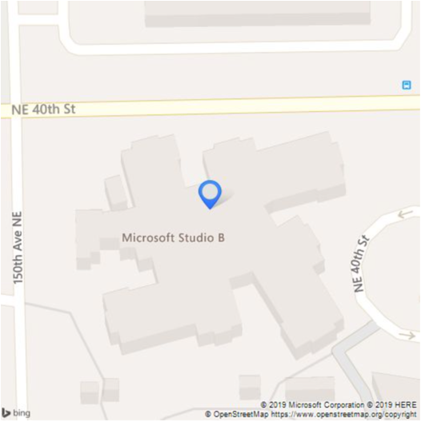

### Get a map with Road imagery and traffic flow based on a query  
 This example gets a map with road imagery based on a query result Bellevue, Washington. Traffic flow is also included on the map.  
  
```url
https://dev.virtualearth.net/REST/V1/Imagery/Map/Road/Bellevue%20Washington?mapLayer=TrafficFlow&key={BingMapsAPIKey}  
```  
  
 This example returns the following image.  
  
  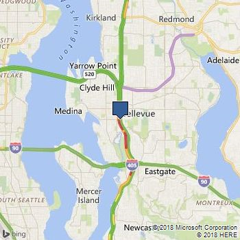
  
  
### Get a map with Aerial imagery based on a query 
  
This example gets a map with aerial imagery and labels based on a query result for the Eiffel Tower in Paris. The map has a width of 500 pixels and height of 400 pixels.  
  
```url
https://dev.virtualearth.net/REST/v1/Imagery/Map/AerialWithLabels/eiffel%20tower?mapSize=500,400&key={BingMapsAPIKey} 
```  
  
 This example returns the following image.  
  
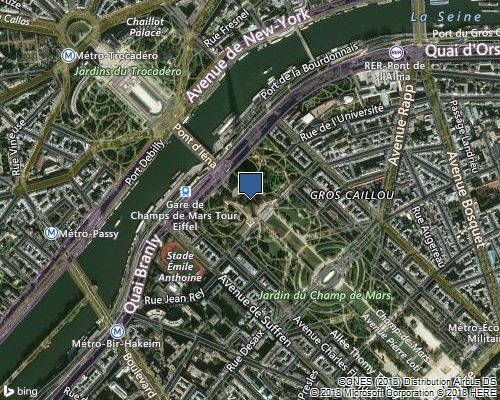
  

  
### Get a map with Road imagery and pushpins that is centered at a specified point
  
This example creates a map with road imagery and places pushpins on the Space Needle, the Pacific Science Center, and the Olympic Sculpture Park in Seattle. The `centerPoint` of the map is set to 47.619048 degrees latitude and -122.35384 degrees longitude. The `zoomLevel` is set to 15.  
  
```url
https://dev.virtualearth.net/REST/v1/Imagery/Map/Road/47.619048,-122.35384/15?mapSize=500,500&pp=47.620495,-122.34931;21;AA&pp=47.619385,-122.351485;;AB&pp=47.616295,-122.3556;22&key={BingMapsAPIKey}  
```  
  
 This example returns the following image.  
  
 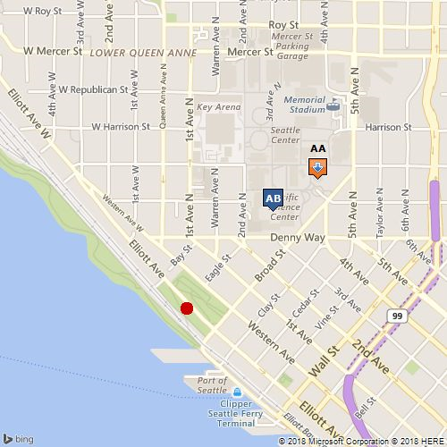
  
### Get the static map metadata for a map with Road imagery and pushpins that is centered at a specified point
  
 This example specifies the same map parameters as the previous example and adds the mapMetadata parameter to get the map metadata. Map metadata includes the map size, area and center point and the position and size of the pushpins. To see the XML and JSON responses for this request and for descriptions of the metadata information, see [Static Map Data](static-map-data.md).  
  
```url
https://dev.virtualearth.net/REST/v1/Imagery/Map/Road/47.619048,-122.35384/15?mapSize=500,500&pp=47.620495,-122.34931;21;AA&pp=47.619385,-122.351485;;AB&pp=47.616295,-122.3556;22&mapMetadata=1&o=xml&key={BingMapsAPIKey}
```  
  
 ### Get a map with Road imagery and declutter overlapping pushpins
  
 This example creates a map with road imagery and specifies two pushpins that are located very close together. The `declutterPins` (`dcl`) parameter is set so that the pushpins both appear separately. If the `declutterPins` parameter were not set, the pushpins would overlap. Maps for both cases are shown below.  
  
```url
https://dev.virtualearth.net/REST/v1/Imagery/Map/Road/47.6156352,-122.2043549/12?pp=47.6156352,-122.2043549;;1&pp=47.612441,-122.204533;;2&dcl=1&key=BingMapsAPIKey  
```  
  
 This example returns the following image.  
  
  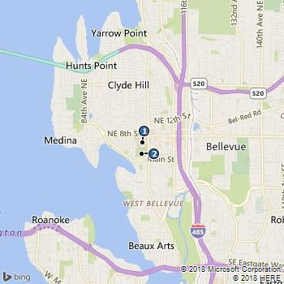 
  
 If the declutter parameter was not set in this example, the pushpins would overlap as shown in the following image.  
  
  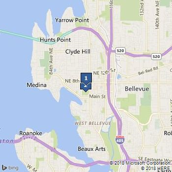 
  
### Get a map with Aerial imagery and pushpins without specifying a map area or center point 
  
 This example creates a map with aerial imagery with labels and specifies 5 pushpins. Because a map area or center point is not specified, a map area is chosen that best shows all of the pushpins. The map is optimized to fit the pushpins.
  
```url
https://dev.virtualearth.net/REST/v1/Imagery/Map/AerialWithLabels?pp=40.804000,-74.464460;;1&pp=40.815180,-74.219250;;2&pp=40.881210,-74.168020;;3&pp=40.810830,-74.260250;;4&pp=40.851800,-74.299900;;5&key={BingMapsAPIKey}  
```  
  
 This example returns the following image.  
  
  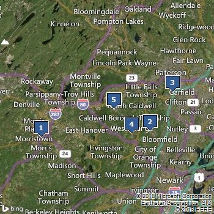
  
  
 ### Get a map with Road imagery for a specified map area
  
 This example gets a map of the specified area that shows road imagery with traffic flow. The map shows the San Francisco metropolitan area and pushpins identify the location of Stanford University and the University of California at Berkeley.  
  
```url
https://dev.virtualearth.net/REST/V1/Imagery/Map/road?mapArea=37.317227,-122.318439,37.939081,-122.194565&ms=500,600&pp=37.869505,-122.2705;35;BK&pp=37.428175,-122.169680;;ST&ml=TrafficFlow&key={BingMapsAPIKey}  
```  
  
 This example returns the following image.  
  
 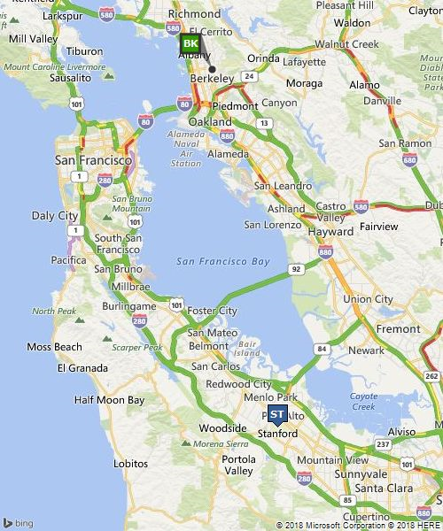
 

### Get a map with Road imagery that displays a route
  
 This example gets a map with road imagery that displays a driving route between the cities of Seattle and Redmond in Washington State.  Custom icons 64 and 66 are chosen to display the endpoints which are identified as “1” and “2”.  
  
```url
https://dev.virtualearth.net/REST/v1/Imagery/Map/Road/Routes?wp.0=Seattle,WA;64;1&wp.1=Redmond,WA;66;2&key={BingMapsAPIKey}   
```  
  
 This example returns the following image.  
  
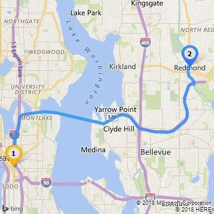
  
 
  
### Get a map with Road imagery centered at a point with a specified zoom level
  
 This example uses a center point and zoom level to get a map that shows the end of the route between Seattle and Redmond from the previous example. The center point is the latitude and longitude coordinates of Redmond. You can use the [Find a Location by Address](../locations/find-a-location-by-address.md) API to get the latitude and longitude coordinates of a location.  
 
```url
https://dev.virtualearth.net/REST/v1/Imagery/Map/Road/47.678559869527817,-122.13099449872971/14/Routes? wp.0=Seattle,WA;64;1&wp.1=Redmond,WA;66;2&key={BingMapsAPIKey}
```  
  
 This example returns the following image.  
 
 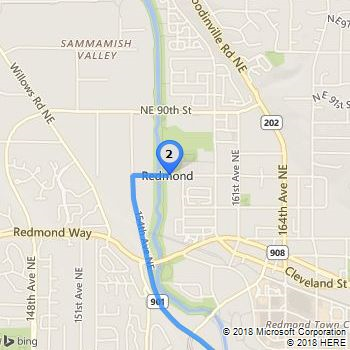
  
  
### Get maps with Road imagery that displays a transit route and zoomed views of the start and end points
  
 The following examples show how to get a map with road imagery that displays a transit route from the Space Needle in Seattle, Washington to Bellevue Downtown Park in Bellevue, Washington at 3 PM of the current day. The three URL examples display the entire route and zoomed views of the start and end points of the route. Note that the walking segments of the route are displayed as dotted lines.  
  
 View of the complete transit route.  
  
```url
https://dev.virtualearth.net/REST/V1/Imagery/Map/Road/Routes/Transit?wp.0=Space%20Needle&wp.1=Bellevue%20Downtown%20Park&timeType=Departure&dateTime=3:00:00PM&output=xml&key={BingMapsAPIKey}
```  
  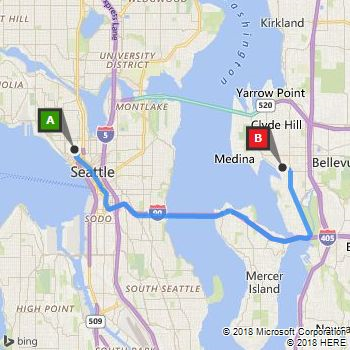
 
  
 View the start of the transit route by specifying a center point and zoom level. The center point for this map is the coordinates for the Space Needle that are returned in the response when you request a transit route by using the c[Calculate a Route](../routes/calculate-a-route.md) API. This map includes a walking route that is shown by a dotted line.  
  
```url
https://dev.virtualearth.net/REST/v1/Imagery/Map/Road/47.620495,-122.34931/15/Routes/Transit?timeType=Departure&dateTime=3:00:00PM&wp.0=Space%20Needle&wp.1=Bellevue%20Downtown%20Park&key={BingMapsAPIKey}  
```  
 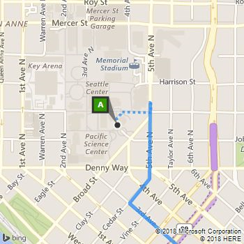
  
  
 View the end of the transit route by specifying a center point and zoom level. The center point for this map is the coordinates of the Bellevue Downtown Park in that is returned in the response when you request a transit route by using the [Calculate a Route](../routes/calculate-a-route.md) API. This map includes a walking route that is shown by a dotted line.  
  
```url
https://dev.virtualearth.net/REST/v1/Imagery/Map/Road/47.615635,-122.20435/15/Routes/Transit?timeType=Departure&dateTime=3:00:00PM&wp.0=Space%20Needle&wp.1=Bellevue%20Downtown%20Park&key={BingMapsAPIKey}  
```  
  
  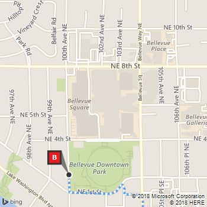
 
 
 ### Get a Bird's Eye map
This example gets a Bird's Eye map with a West orientation (dir=270) at zoom level 20. The map has a width of 900 pixels and a height of 700 pixels.

```url
http://dev.virtualearth.net/REST/V1/Imagery/Map/Birdseye/37.802297,-122.405844/20?dir=270&ms=900,700&key={BingMapsAPIKey}
```
This example returns the following image.

  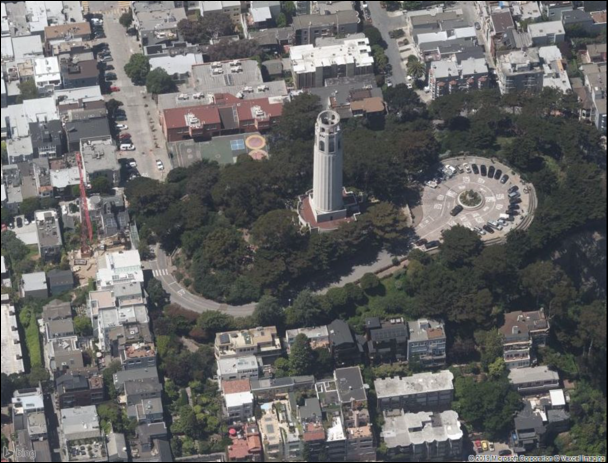
 
### Get Street Side Images using the StreetSide Imagery API

The following URL request gets an image of Bergen Place in Ballard, Seattle, with a pitch of 5&deg; (upwards) and a heading of 145&deg; (degrees clockwise from North, which is at 0&deg;). The zoom level is 5. For more details about the Streetside Imagery API, see [Getting Streetside Tiles from Imagery Metadata](../../articles/getting-streetside-tiles-from-imagery-metadata.md).

If you examine the response headers, you'll find that `X-VE-SS-CaptureDate` is set to `Wed, 16 Jul 2014 17:13:06 GMT`.

```url
http://dev.virtualearth.net/REST/v1/Imagery/Map/Streetside/47.668687,-122.384795?zoomlevel=5&heading=145&pitch=5&mapSize=600,350&key={BingMapsAPIKey}
``` 

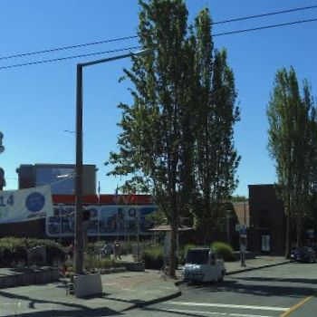
  
### Get a map that displays pushpins by using the HTTP POST Method  
  
The following example shows how to request a static map by using the HTTP POST method. When you use this method, you can specify up to 100 pushpins. All pushpins must be in the body of the request. Because the request does not specify a map area or center point and zoom level, the map area is optimized to show all of the pushpins.  
  
 **HTTP POST URL**  
  
```url
https://dev.virtualearth.net/REST/v1/Imagery/Map/Road/?key={BingMapsAPIKey}  
```  
  
 **HTTP POST Header**  
  
 You must include the following settings in the HTTP POST Header.  
  
```url
Content-Length: insertLengthOfHTTPBody  
Content-Type: text/plain; charset=utf-8  
```  
  
 **HTTP POST Body**  
  
 When specifying pushpins in the request body, you can use a carriage return (`\r\n`) or an ampersand (`&`) as a delimiter. The following two examples show these options.  
  
 **Example 1**  
  
```url
pp=38.889586530732335,-77.05010175704956;23;LM\r\n  
pp=38.88772364638439,-77.0472639799118;7;KM\r\n  
pp=38.890479451480054,-77.04744637012482;1;VM\r\n  
pp=38.8896854931628,-77.03519403934479;45;WM   
```  
  
 **Example 2**  
  
```url
pp=38.889586530732335,-77.05010175704956;23;LM&pp=38.88772364638439,-77.0472639799118;7;KM\r\n  
pp=38.890479451480054,-77.04744637012482;1;VM&pp=38.8896854931628,-77.03519403934479;45;WM 
```  
  
 This example returns the following image.  
  
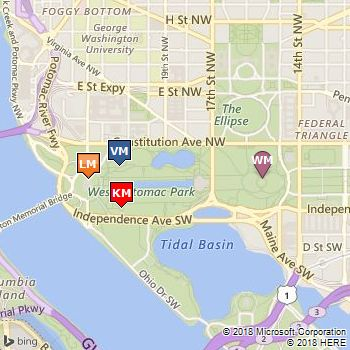
 
  
### Get a map with Ordnance Survey imagery that is provided in JPEG format  
  
 This example shows a map of Trafalgar Square in Great Britain using Ordnance Survey imagery. The static map is returned in JPEG format. If this image format were not specified in the URL, the static map would be returned in the default PNG format.  
  
```url
https://dev.virtualearth.net/REST/v1/Imagery/Map/Road/51.506666,-0.129436/15?ml=OrdnanceSurvey&format=jpeg&key={BingMapsAPIKey}
```  
  
 This example returns the following image.  
  
   
  
### Get a map that will highlight the polygo    n for an entity 
  
 This example shows a map using the `HighlightEntity` (he=1) parameter with a value of `admindivision1` to show a map with a polygon for Washington State. The latitude and longitude is a point that is within the entity that you want to highlight.  
  
```url
https://dev.virtualearth.net/REST/v1/Imagery/Map/Road/Washington%20State?ms=500,270&c=en-US&he=1&key={BingMapsAPIKey}
```  
  
 This example returns the following image.  
  
 
  
 This example shows a map using the `HighlightEntity` (`he=1`) parameter with a value of `PopulatedPlace` to show a map with a polygon for the city of Redmond. The latitude and longitude is a point that is within the entity that you want to highlight.  
  
```url
https://dev.virtualearth.net/REST/v1/Imagery/Map/Road/Redmond Washington?ms=500,270&zl=12&&c=en-US&he=1&key={BingMapsAPIKey}
```  
  
 This example returns the following image.  
  
 
### Draw a Green Circle using the `drawCurve` Parameter

This example draws a green circle around the Palo Alto area in California by specifying a circle with the outline line color `64009900` (dark green), the fill color `FF009900` (lime green), with an outline thickness of 2 pixels, and a radius of 50 pixels.

```url
http://dev.virtualearth.net/REST/V1/Imagery/Map/Road/37.6288,-122.2565/10?mapSize=500,600&dc=c,64009900,FF009900,2,50;37.428175,-122.16968&fmt=png&key={BingMapsAPIKey}``
```

Here is the resulting PNG file:


  
### Draw Green Polygons and Lines over the Bay Area using the `drawCurve` Parameter

This example draws an overlapping green polygon across the Bay Area in California. The `drawCurve` parameter is specified as a polygon (`p`) using the same outline and fill colors are above, using the base 64 encoding: `enc:aemcFngthVojs@asV}_GhahA{xXcw\`.

```url
http://dev.virtualearth.net/REST/V1/Imagery/Map/Road/37.6288,-122.2565/10?mapSize=500,600&dc=p,64009900,FF009900,2;enc:aemcFngthVojs@asV%7d_GhahA%7bxXcw%5C&key={BingMapsAPIKey}
```

Here is the resulting PNG file:

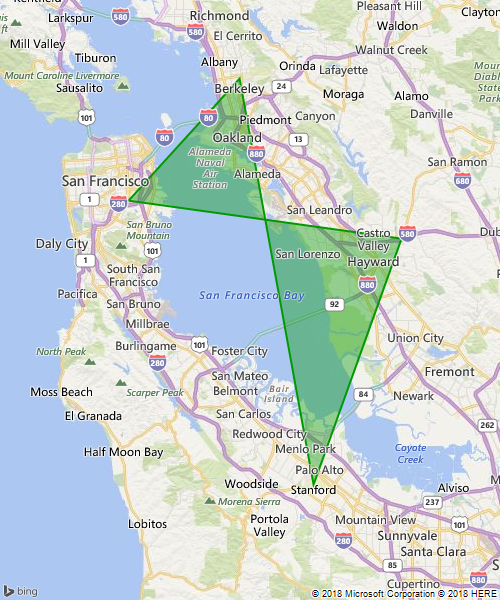
  
In this example, green lines are drawn across the Bay Area; however, the endpoints of the line are encoded in plain text instead of the encoded polyline format:

```url
http://dev.virtualearth.net/REST/V1/Imagery/Map/Road/37.6288,-122.2565/9?mapSize=400,500&dc=l,FF009900,3;37.428175,-122.16968_37.737368,-122.422845_37.869505,-122.2705&fmt=png&key={BingMapsAPIKey}
```  

Here is the resulting PNG image:

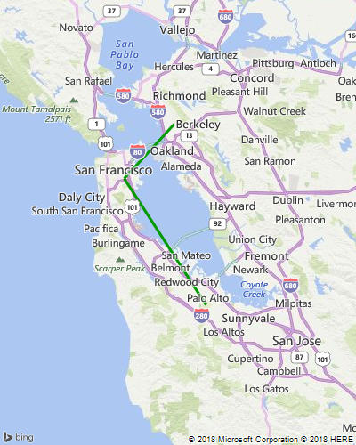  

Finally, using the same coordinates as above, developers can draw curved lines by changing the first parameter of the `drawCurve` input parameters from `l` to `cv`:

```url
http://dev.virtualearth.net/REST/V1/Imagery/Map/Road/37.6288,-122.2565/9?mapSize=400,500&dc=cv,FF009900,3;37.428175,-122.16968_37.737368,-122.422845_37.869505,-122.2705&fmt=png&key={BingMapsAPIKey}
```

And here is the resulting PNG image:

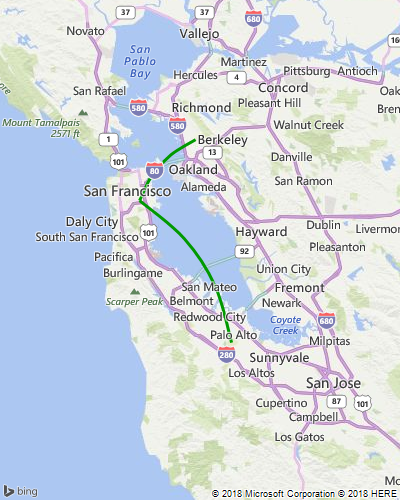

### Draw Pushpoints on a map of the USA using the `drawCurve` Parameter

Use the `pp` parameter, along with `drawCurve`, to draw pushpins on an image and join them with straight or curved lines.

```url
https://dev.virtualearth.net/REST/v1/Imagery/Map/Road/41.03824,-100.76646/3?mapSize=500,500&pp=47.620495,-122.34931;90;&pp=41.88446,-71.23319;90&&pp=25.81692,-80.32291;90&dc=l,,3&key={BingMapsAPIKey}
```

Here is the resulting JPEG image:

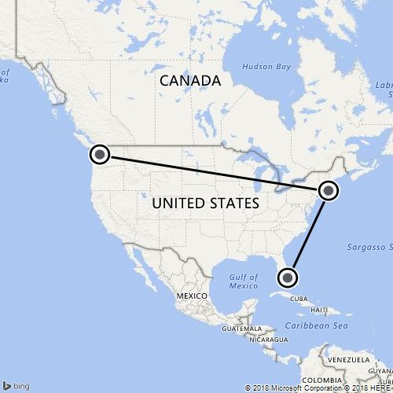

Like in the previous example, `l` in the `drawCurve` parameter can be changed to `cv` to draw curved lines:

```url
https://dev.virtualearth.net/REST/v1/Imagery/Map/Road/41.03824,-100.76646/3?mapSize=500,500&pp=47.620495,-122.34931;90;&pp=41.88446,-71.23319;90&&pp=25.81692,-80.32291;90&dc=cl,,3&key={BingMapsAPIKey}
```

Here is the resulting JPEG image:

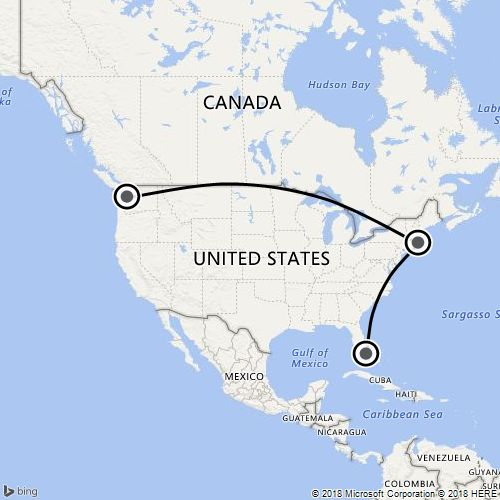
  
## HTTP Status Codes  

[!INCLUDE [get-status-code-note](../../includes/get-status-code-note.md)]
  
 When the request is successful, the following HTTP status code is returned.  
  
* 200

When the request is not successful, the response returns one of the following errors.

* 400
* 401
* 404
* 429
* 500
* 503 
  
## See Also  
 [Using the REST Services with .NET](../using-the-rest-services-with-net.md)   
 [JSON Data Contracts](../json-data-contracts.md)
