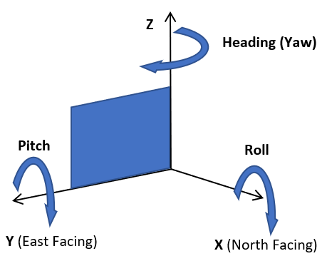

# Imagery Metadata

The response returned by an Imagery Metadata URL request contains a resource that provides imagery metadata information. If the metadata requested is for Birdseye imagery, a Birdseye Metadata resource is returned. For other types of imagery, an Imagery Metadata resource is returned. This topic contains descriptions of the information elements in these resources, followed by JSON and XML examples.  
  
[!INCLUDE [get-common-response-note](../../includes/get-common-response-note.md)] 
  
## Common Imagery Resource Fields

The following fields are used in the Imagery Metadata, the Birdseye Metadata, and Streetside Metadata resources.  
  
|JSON|XML|Type|Description|  
|----------|---------|----------|-----------------|  
|`imageUrl`|`ImageUrl`|`URI`|One of the following:<br /><br /> A URL template for an image tile if a specific point is specified.<br /><br /> A general URL template for the specified imagery set.<br /><br /> **Note:**  For more information about the URI placeholder fields that may appear in the image tile, see [Understanding the Image URL Placeholders](#understanding-the-image-url-placeholders) section below.|  
|`imageUrlSubdomains`|`ImageUrlSubdomains`|`string`|One or more URL subdomains that may be used when constructing an image tile URL.|  
|`imageWidth`|`ImageWidth`|`integer`|The width of the image tile.|  
|`imageHeight`|`ImageHeight`|`integer`|The height of the image tile.|  
|`vintageStart`|`VintageStart`|`DateTime`|The earliest date found in an imagery set or for a specific imagery tile.|  
|`vintageEnd`|`VintageEnd`|`DateTime`|The latest date found in an imagery set or for a specific imagery tile.|  
|`zoomMin`|`ZoomMin`|`integer`|The minimum zoom level available for this imagery set.|  
|`zoomMax`|`ZoomMax`|`integer`|The maximum zoom level available for this imagery set.|  
  
## Birdseye Metadata Resource Fields

These fields are only used only by the Birdseye Metadata resource.  
  
|JSON|XML|Type|Description|  
|----------|---------|----------|-----------------|  
|`orientation`|`Orientation`|`double`|The orientation of the viewport for the imagery metadata in degrees where 0 = North [default], 90 = East, 180 = South, 270 = West.|  
|`tilesX`|`TilesX`|`integer`|The horizontal dimension of the imagery in number of tiles.|  
|`tilesY`|`TilesY`|`integer`|The vertical dimension of the imagery in number of tiles.|  

## Streetside Metadata Resource Fields

Along with the above Common Imagery Resource fields, the Streetside Metadata resources contains the following fields. The order of these fields may differ between XML and JSON responses.

|JSON|XML|Type|Description|  
|----------|---------|----------|-----------------|  
|`lat` | `Latitude` | `double` | The latitude of the specified center point. |
|`lon` | `Longitude` |  `double` | The longitude of the specified center point.|
|`pi`| `Pitch` | `double`| The pitch is the degree from `-90`&deg; (facing down) to `90`&deg; (facing up) which the image was taken. When the pitch is `0`&deg;, the image was take facing directly forward.  |
|`ro`| `Roll` | `double` | Roll is how much the image is tilted when it was taken. A roll of 0&deg; means the image was created along the East/West axis. |  

> [!NOTE]
>
> The values for `pitch`, `roll`, and `heading` in the `Streetside` Metadata response are values for *the camera that captured the image*. Positive angles indicate clockwise rotation, negative angles indicate a counterclockwise rotation.
>
> 
>
> For more information, see how heading (yaw), roll, and pitch are used in [Aeronautics and Flight](https://en.wikipedia.org/wiki/Aircraft_principal_axes) on Wikipedia.

  
## Understanding the Image URL Placeholders

When you request imagery metadata, the image URL field returned in the response specifies a map tile. This map tile can contain one or more of the following placeholders.  
  
|URI placeholder|Description|  
|---------------------|-----------------|  
|{culture}|The culture of the map. The culture value determines the language that is used to display text. For a list of cultures that are supported by the Imagery API, see [Culture Parameter](../common-parameters-and-types/culture-parameter.md).|  
|{quadkey}|The quadkey of the tile. For information about quadkeys, see b[Bing Maps Tile System](../../articles/bing-maps-tile-system.md).|  
|{subdomain}|The sub-domain to use to retrieve tiles to allow maximum performance for network calls. The value values are `t0`, `t1`, `t2`, or `t3`.|  
|{tileId}|TileId is an index from 0 to `(tilesX * tilesY) - 1` indicating a specific tile in the scene. 0 is top left corner and tiles are numbered in row order. So increasing values go left to right and then top to bottom.|  
|{zoom}|The zoom level of the map.|  
  
## Examples  
 The following examples show the resources returned by the Imagery Metadata API.  
  
### Imagery Street Resource Example

Also see [Getting Streetside Tiles from Imagery Metadata](../../articles/getting-streetside-tiles-from-imagery-metadata.md). 

```json
{
  "authenticationResultCode": "ValidCredentials",
  "brandLogoUri": "http://dev.virtualearth.net/Branding/logo_powered_by.png",
  "copyright": "Copyright © 2018 Microsoft and its suppliers. All rights reserved. This API cannot be accessed and the content and any results may not be used, reproduced or transmitted in any manner without express written permission from Microsoft Corporation.",
  "resourceSets": [
    {
      "estimatedTotal": 1,
      "resources": [
        {
          "__type": "StreetsideMetadata:http://schemas.microsoft.com/search/local/ws/rest/v1",
          "imageHeight": 256,
          "imageUrl": "http://ecn.{subdomain}.tiles.virtualearth.net/tiles/hs0203232101212100{faceId}{tileId}?g=6617&key={BingMapsAPIKey}",
          "imageUrlSubdomains": [
            "t0",
            "t1",
            "t2",
            "t3"
          ],
          "imageWidth": 256,
          "imageryProviders": null,
          "vintageEnd": "17 Jul 2014 GMT",
          "vintageStart": "17 Jul 2014 GMT",
          "zoomMax": 4,
          "zoomMin": 1,
          "he": 52.286,
          "lat": 47.668696,
          "lon": -122.384813,
          "pi": 0.638,
          "ro": -0.326
        }
      ]
    }
  ],
  "statusCode": 200,
  "statusDescription": "OK",
  "traceId": "3f6f6409f04d4e4b93dcdd50fee6b508|CO3124D6DA|7.7.0.0"
}
```
  
```xml
<?xml version="1.0" encoding="ISO-8859-1"?>
<Response xmlns="http://schemas.microsoft.com/search/local/ws/rest/v1" xmlns:xsi="http://www.w3.org/2001/XMLSchema-instance" xmlns:xsd="http://www.w3.org/2001/XMLSchema">
    <Copyright>Copyright © 2018 Microsoft and its suppliers. All rights reserved. This API cannot be accessed and the content and any results may not be used, reproduced or transmitted in any manner without express written permission from Microsoft Corporation.</Copyright>
    <BrandLogoUri>http://dev.virtualearth.net/Branding/logo_powered_by.png</BrandLogoUri>
    <StatusCode>200</StatusCode>
    <StatusDescription>OK</StatusDescription>
    <AuthenticationResultCode>ValidCredentials</AuthenticationResultCode>
    <TraceId>f2346d38931d4d28abe5c9d7361c3a53|CO3CCB729A|7.7.0.0</TraceId>
    <ResourceSets>
        <ResourceSet>
            <EstimatedTotal>1</EstimatedTotal>
            <Resources>
                <ImageryMetadata xsi:type="StreetsideMetadata">
                    <ImageUrl>http://ecn.{subdomain}.tiles.virtualearth.net/tiles/hs0203232101212100{faceId}{tileId}?g=6617&key={BingMapsAPIKey}</ImageUrl>
                    <ImageUrlSubdomains>
                        <string>t0</string>
                        <string>t1</string>
                        <string>t2</string>
                        <string>t3</string>
                    </ImageUrlSubdomains>
                    <ImageWidth>256</ImageWidth>
                    <ImageHeight>256</ImageHeight>
                    <ZoomMin>1</ZoomMin>
                    <ZoomMax>4</ZoomMax>
                    <VintageStart>2014-07-17</VintageStart>
                    <VintageEnd>2014-07-17</VintageEnd>
                    <Latitude>47.668696</Latitude>
                    <Longitude>-122.384813</Longitude>
                    <Roll>-0.326</Roll>
                    <Pitch>0.638</Pitch>
                    <Heading>52.286</Heading>
                </ImageryMetadata>
            </Resources>
        </ResourceSet>
    </ResourceSets>
</Response>
```  
  
### Imagery Metadata Resource Example  
  
```json  
{  
  "imageHeight":256,  
  "imageUrl":"http:\/\/ecn.t2.tiles.virtualearth.net\/tiles\/a0212300322.jpeg?g=414&mkt={culture}",  
  "imageUrlSubdomains":null,  
  "imageWidth":256,  
  "vintageEnd":"01 Mar 2001 GMT",  
  "vintageStart":"01 Mar 2001 GMT",  
  "zoomMax":10,  
  "zoomMin":10  
}  
```  
  
```xml  
<ImageryMetadata>  
  <ImageUrl>http://ecn.t2.tiles.virtualearth.net/tiles/a0212300322.jpeg?g=414&mkt={culture}</ImageUrl>  
  <ImageWidth>256</ImageWidth>  
  <ImageHeight>256</ImageHeight>  
  <ZoomMin>10</ZoomMin>  
  <ZoomMax>10</ZoomMax>  
  <VintageStart>2001-03-01</VintageStart>  
  <VintageEnd>2001-03-01</VintageEnd>  
</ImageryMetadata>  
```  
  
### Birdseye Imagery Resource Example  
  
```xml  
<BirdseyeMetadata>
    <ImageUrl>http://ak.{subdomain}.tiles.virtualearth.net/tiles/be000122033113001-9-14-{zoom}-{tileId}.jpeg?g=6644&key={BingMapsAPIKey}</ImageUrl>
    <ImageUrlSubdomains>
        <string>t0</string>
        <string>t1</string>
        <string>t2</string>
        <string>t3</string>
    </ImageUrlSubdomains>
    <ImageWidth>512</ImageWidth>
    <ImageHeight>512</ImageHeight>
    <ZoomMin>18</ZoomMin>
    <ZoomMax>21</ZoomMax>
    <VintageStart>2013-10-17</VintageStart>
    <VintageEnd>2013-10-17</VintageEnd>
    <Orientation>0</Orientation>
    <TilesX>9</TilesX>
    <TilesY>14</TilesY>
</BirdseyeMetadata>
```  
  
```json  
{
  "__type": "ImageryMetadata:http://schemas.microsoft.com/search/local/ws/rest/v1",
  "imageHeight": 256,
  "imageUrl": "http://ecn.{subdomain}.tiles.virtualearth.net/tiles/r{quadkey}.jpeg?g=6644&mkt={culture}&shading=hill",
  "imageUrlSubdomains": [
    "t0",
    "t1",
    "t2",
    "t3"
  ],
  "imageWidth": 256,
  "imageryProviders": null,
  "vintageEnd": null,
  "vintageStart": null,
  "zoomMax": 21,
  "zoomMin": 1
}
```