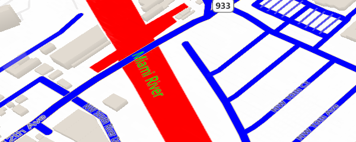

# Map Style Sheet Reference in Maps

A map style sheet defines the appearance of a map in various [Microsoft map controls](map-style-sheet-support.md).  A map style sheet consists primarily of [entries](map-style-sheet-entries.md) and [properties](map-style-sheet-entry-properties.md) on those entries that you can override to customize the appearance.

Map style sheets can be created interactively using the [Map Style Sheet Editor application](https://www.microsoft.com/store/productId/9NBHTCJT72FT).

## JSON Style Sheet Format

The primary way to represent a map style sheet is using JavaScript Object Notation (JSON). The following JSON can be used to make land appear white, water red, water labels green, and roads fill with blue:

```json
{   
    "version":"1.*",
    "settings":{"landColor":"#FFFFFF"},
    "elements":{
        "water":{"fillColor":"#FF0000","labelColor":"#00FF00"}, 
        "road":{"fillColor":"#0000FF"}}
}
```



This JSON can be used to remove all labels and points from a map.

```json
{
    "version":"1.*", 
    "elements":{"mapElement":{"labelVisible":false},"point":{"visible":false}}
}
```

Sometimes the value of a property is transformed to produce the final result. For example, vegetation fillColor has slightly different shades depending on type of the entity being displayed. This behavior can be turned off, thereby using the precise provided value, by using the ignoreTransform property.

```json
{
    "version":"1.*",
    "settings":{"shadedReliefVisible":false},
    "elements":{"vegetation":{"fillColor":{"value":"#999999","ignoreTransform":true}}}
}
```

## Web Only URL Style Sheet Format

For simple style changes with the [static map control](../rest-services/imagery/get-a-static-map), compact versions of the style sheet can be used through URL parameters.  These can be done with the long form:

```url
water|fillColor:FF0000;labelColor:00FF00_road|fillColor:0000FF_global|landColor:FFFFFF 
```

...or the short form:

```url
wt|fc:FF0000;lbc:00FF00_rd|fc:0000FF_g|landColor:FFFFFF
```

The URL style sheet can then be appended to a REST Static Image request or a tile URL. For example:

```url
http://dev.virtualearth.net/REST/V1/Imagery/Map/Road/Bellevue%20Washington?&key=[YOUR_BING_MAPS_KEY]&st=wt|fc:FF0000;lbc:00FF00_rd|fc:0000FF_g|landColor:FFFFFF
```

Here is the image this request would return:


If the style is too long for a URL, when using the REST imagery service, the style can be passed in using a POST request. The POST data object format is: `style=[Your custom style]`
