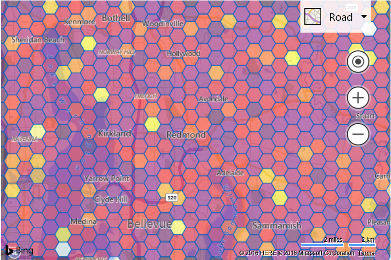

# Color Scale Gradient Data Bins
This example shows how to use a linear gradient to assign colors to data bins based on the relative number of pushpins in each bin. Data bins that are white have the most pushpins, while those that are darker in color have less.

```
<!DOCTYPE html>
<html>
<head>
    <title></title>
    <meta charset="utf-8" />
    <script type='text/javascript' src='https://www.bing.com/api/maps/mapcontrol?callback=GetMap' async defer></script>

    <script type='text/javascript'>
    var map;
    var heatGradientData;

    function GetMap()
    {
        map = new Microsoft.Maps.Map('#myMap', {
            credentials: 'Your Bing Maps Key'
        });

        var pins = Microsoft.Maps.TestDataGenerator.getPushpins(10000, map.getBounds());

        for (var i = 0, len = pins.length; i < len; i++) {
            pins[i].metadata = {
                myValue: Math.random() * 100
            };
        }

        createHeatGradient();

        Microsoft.Maps.loadModule('Microsoft.Maps.DataBinning', function () {
            var layer = new Microsoft.Maps.DataBinningLayer(pins, {
                aggregationProperty: 'myValue',
                colorCallback: function (bin, min, max) {
                    return getLegendColor(bin.metrics.count, max.count);
                }
            });
            map.layers.insert(layer);
        });
    }

    function createHeatGradient() {
        var canvas = document.createElement('canvas');
        var ctx = canvas.getContext('2d');

        //Create a linear gradient for the legend. 
        var colorGradient = {
            '0': 'Black',
            '0.4': 'Purple',
            '0.6': 'Red',
            '0.8': 'Yellow',
            '1': 'White'
        };

        var grd = ctx.createLinearGradient(0, 0, 256, 0);
        for (var c in colorGradient) {
            grd.addColorStop(c, colorGradient[c]);
        }
        ctx.fillStyle = grd;
        ctx.fillRect(0, 0, canvas.width, canvas.height);

        //Store the pixel information from the legend.
        heatGradientData = ctx.getImageData(0, 0, canvas.width, 1);
    }

    function getLegendColor(value, maxValue) {
        value = (value > maxValue) ? maxValue : value;

        //Calculate the pixel data index from the ratio of value/maxValue.
        var idx = Math.round((value / maxValue) * 256) * 4 - 4;

        if (idx < 0) {
            idx = 0;
        }

        //Create an RGBA color from the pixel data at the calculated index.
        return 'rgba(' + heatGradientData.data[idx] + ',' +
            heatGradientData.data[idx + 1] + ',' +
            heatGradientData.data[idx + 2] + ',' + '0.5)';
    }
    </script>
</head>
<body>
    <div id="myMap" style="position:relative;width:600px;height:400px;"></div>
</body>
</html>
```

Running this code in your browser will display a map filled with hexagon data bins that are colored based on the number of pushpins in each bin using a linear gradient as a color source.


 
[Try it now](http://www.bing.com/api/maps/sdk/mapcontrol/isdk#gradientColorScaleBinning+JS)
