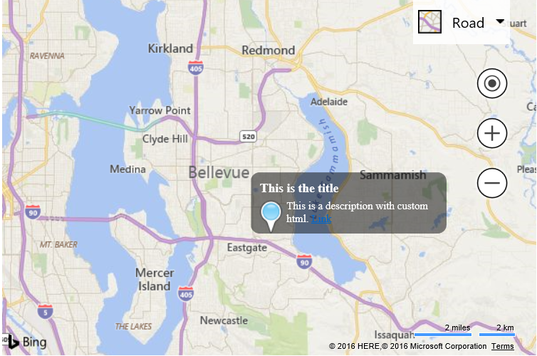

# Custom HTML Infobox
For many apps the default infobox and the various options for customizing it work well, however sometimes being able to full customize it is desirable. This example shows how to create an infobox using custom HTML. To make things a bit cleaner a HTML template string is created that contains placeholders for a title and description. 

```
<!DOCTYPE html>
<html>
<head>
    <title></title>
    <meta charset="utf-8" />
	<script type='text/javascript'>
    var map;

    //Define an HTML template for a custom infobox.
    var infoboxTemplate = '<div class="customInfobox"><div class="title">{title}</div>{description}</div>';

    function GetMap() {
        map = new Microsoft.Maps.Map('#myMap',
            {});

        var center = map.getCenter();

        //A title and description for the infobox.
        var title = 'This is the title';
        var description = 'This is a description with custom html. <a href="http://bing.com/maps" target="_blank">Link</a>';

        //Pass the title and description into the template and pass it into the infobox as an option.
        var infobox = new Microsoft.Maps.Infobox(center, {
            htmlContent: infoboxTemplate.replace('{title}', title).replace('{description}', description)
        });

        //Assign the infobox to a map instance.
        infobox.setMap(map);
    }
    </script>
    <style>
        /* CSS styles used by custom infobox template */
        .customInfobox {
            background-color: rgba(0,0,0,0.5);
            color: white;
            max-width: 200px;
            border-radius: 10px;
            padding: 10px;
            font-size:12px;
            pointer-events:auto !important;
        }

            .customInfobox .title {
                font-size: 14px;
                font-weight: bold;
                margin-bottom: 5px;
            }
    </style>
    <script type='text/javascript' src='http://www.bing.com/api/maps/mapcontrol?callback=GetMap&key=[YOUR_BING_MAPS_KEY]' async defer></script>
</head>
<body>
    <div id="myMap" style="position:relative;width:600px;height:400px;"></div>
</body>
</html>
```

This code creates an infobox sing custom HTML which contains an image and a link.

