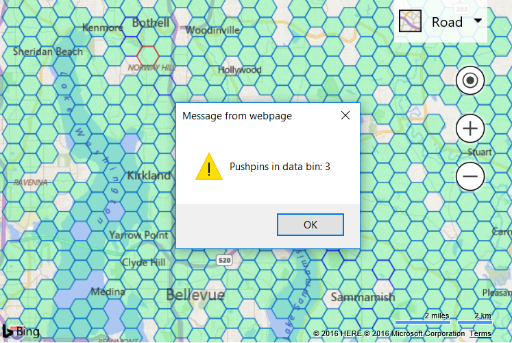

# Data Binning Layer Events
The Data Binning layer extends from the Layer class and has all the same events available. Events can be added directly to the layer and will fire for the shapes in the layer. Alternatively, you can also loop through each shape in the layer and add an event to individual shapes.

This example shows how to add events to the data binning layer which will fire when the mouse hovers over one of the data bins. When hovered the outline stroke color of the data bin will turn red. Clicking on the data bin will display the number of pushpins that are in the data bin.

```
<!DOCTYPE html>
<html>
<head>
    <title></title>
    <meta charset="utf-8" />
    <script type='text/javascript' src='https://www.bing.com/api/maps/mapcontrol?callback=GetMap' async defer></script>

    <script type='text/javascript'>
    var map;

    function GetMap()
    {
        map = new Microsoft.Maps.Map('#myMap', {
            credentials: 'Your Bing Maps Key'
        });

        //Generate random test pushpins. 
        var pins = Microsoft.Maps.TestDataGenerator.getPushpins(1000, map.getBounds());

        //Load Data Binning module.
        Microsoft.Maps.loadModule('Microsoft.Maps.DataBinning', function () {
            //Create the Data Binning Layer.
            var layer = new Microsoft.Maps.DataBinningLayer(pins);

            //When the user clicks a data bin polygon, display the number of pushpins in the data bin.
            Microsoft.Maps.Events.addHandler(layer, 'click', function (e) {
                var bin = e.primitive;

                alert('Pushpins in data bin: ' + bin.dataBinInfo.containedPushpins.length);
            });

            //When the user mouses over of a data bin polygon, set its stroke color to red.
            Microsoft.Maps.Events.addHandler(layer, 'mouseover', function (e) {
                e.primitive.setOptions({ strokeColor: 'red' });
            });

            //When the user mouses out of a data bin polygon, set its stroke color to blue.
            Microsoft.Maps.Events.addHandler(layer, 'mouseout', function (e) {
                e.primitive.setOptions({ strokeColor: 'blue' });
            });

            //Add the layer to the map.
            map.layers.insert(layer);
        });
    }
    </script>
</head>
<body>
    <div id="myMap" style="position:relative;width:600px;height:400px;"></div>
</body>
</html>
```

Running this code in the browser will display hexagon bins on the map. If you however the mouse pointer over one of the polygons, its outline stroke color will turn red. Clicking on the data bin will display the number of pushpins that are in the data bin.


 
[Try it now](http://www.bing.com/api/maps/sdk/mapcontrol/isdk#basicBinningWithEvents+JS)
