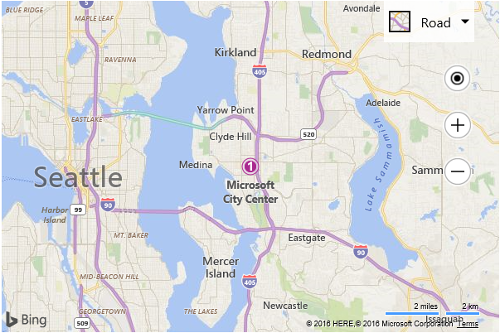

# Default Pushpin with Text Example
The following code creates a pushpin at the center of the map that has a text value set to "1". A title value set to "Microsoft" and a subTitle value set to "City Center".

```
<!DOCTYPE html>
<html>
<head>
    <title></title>
    <meta charset="utf-8" />
	<script type='text/javascript'>
    function GetMap() {
        var map = new Microsoft.Maps.Map('#myMap', {
            credentials: 'Your Bing Maps Key',
            center: new Microsoft.Maps.Location(47.6149, -122.1941)
        });

        var center = map.getCenter();

        //Create custom Pushpin
        var pin = new Microsoft.Maps.Pushpin(center, {
            title: 'Microsoft',
            subTitle: 'City Center',
            text: '1'
        });

        //Add the pushpin to the map
        map.entities.push(pin);
    }
    </script>
    <script type='text/javascript' src='http://www.bing.com/api/maps/mapcontrol?callback=GetMap' async defer></script>
</head>
<body>
    <div id="myMap" style="position:relative;width:600px;height:400px;"></div>
</body>
</html>
```

Here is what this pushpin would look like.

