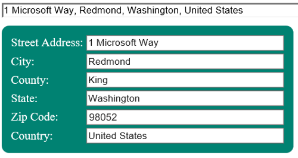

# Filling in an Address Form Example
This example shows how to use the selected result from the default autosuggest UI to fill in an address form. This is much easier than filling in all the fields of the form manually, and less error prone as well. Since this form includes an address line field, we will set the `placeSuggestion` option (city, landmarks…) of AutosuggestManager to false. This will remove place type suggestions and will result in only address suggestions being returned. Also, since the goal of this code example is to make it easy to fill in an address form, the Autosuggest module will be loaded without a map as it isn’t needed.

```
<!DOCTYPE html>
<html>
<head>
    <title></title>
    <meta charset="utf-8" />
	<script type='text/javascript'>
    function GetMap() {
        Microsoft.Maps.loadModule('Microsoft.Maps.AutoSuggest', {
            callback: function () {
                var manager = new Microsoft.Maps.AutosuggestManager({
                    placeSuggestions: false
                });
                manager.attachAutosuggest('#searchBox', '#searchBoxContainer', selectedSuggestion);
            },
            errorCallback: function(msg){
                alert(msg);
            },
            credentials: 'Your Bing Maps Key' 
        });
    }

    function selectedSuggestion(result) {
        //Populate the address textbox values.
        document.getElementById('addressLineTbx').value = result.address.addressLine || '';
        document.getElementById('cityTbx').value = result.address.locality || '';
        document.getElementById('countyTbx').value = result.address.district || '';
        document.getElementById('stateTbx').value = result.address.adminDistrict || '';
        document.getElementById('postalCodeTbx').value = result.address.postalCode || '';
        document.getElementById('countryTbx').value = result.address.countryRegion || '';
    }
    </script>
    <style>
        #searchBox {
            width: 400px;
        }
        
        .addressForm {
            margin-top:10px;
            background-color: #008272;
            color: #fff;
            border-radius:10px;
            padding: 10px;
        }

        .addressForm input{
            width:265px;
        }
    </style>
    <script type='text/javascript' src='http://www.bing.com/api/maps/mapcontrol?callback=GetMap' async defer></script>
</head>
<body>
    <div id='searchBoxContainer'>
        <input type='text' id='searchBox'/>
    </div>

    <table class="addressForm">
        <tr><td>Street Address:</td><td><input type="text" id="addressLineTbx"/></td></tr>
        <tr><td>City:</td><td><input type="text" id="cityTbx"/></td></tr>
        <tr><td>County:</td><td><input type="text" id="countyTbx"/></td></tr>
        <tr><td>State:</td><td><input type="text" id="stateTbx"/></td></tr>
        <tr><td>Zip Code:</td><td><input type="text" id="postalCodeTbx"/></td></tr>
        <tr><td>Country:</td><td><input type="text" id="countryTbx"/></td></tr>
    </table>
</body>
</html>
```

Here is what this code sample looks like when typing in “1 M” and selecting the first result, in this case “1 Microsoft Way, Redmond, WA”. Notice how the form has been filled out after selecting a suggestion. 
 
