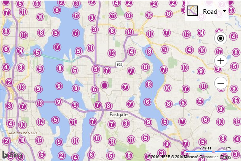

# Basic Clustering Example

The following code example loads the Clustering module and then generates 1,000 random pushpins that are within the current map view using the [TestDataGenerator class](../../map-control-api/testdatagenerator-class.md), which is built into the V8 map control. It then creates an instance of the ClusterLayer class and passes in the pushpins to be clustered and inserts it into the map. 

```html
<!DOCTYPE html>
<html>
<head>
    <title></title>
    <meta charset="utf-8" />
	<script type="text/javascript">
    var map, clusterLayer;

    function GetMap() {
        map = new Microsoft.Maps.Map('#myMap', {});

        //Load the Clustering module.
        Microsoft.Maps.loadModule("Microsoft.Maps.Clustering", function () {
            //Generate 1,000 random pushpins in the map view. 
            var pins = Microsoft.Maps.TestDataGenerator.getPushpins(1000, map.getBounds());

            //Create a ClusterLayer and add it to the map.
            clusterLayer = new Microsoft.Maps.ClusterLayer(pins);
            map.layers.insert(clusterLayer);
        });
    }
    </script>
    <script type='text/javascript' src='http://www.bing.com/api/maps/mapcontrol?callback=GetMap&key=[YOUR_BING_MAPS_KEY]' async defer></script>
</head>
<body>
    <div id="myMap" style="position:relative;width:600px;height:400px;"></div>
</body>
</html>
```

Running this code in a browser will display a map with a bunch of pushpins on it. Those that have numbers on them are clusters of pushpins. As you zoom the map towards a cluster you will see the cluster break apart into its individual pushpins.



[Try it now](http://www.bing.com/api/maps/sdk/mapcontrol/isdk#clusteringMeanAverage+JS)