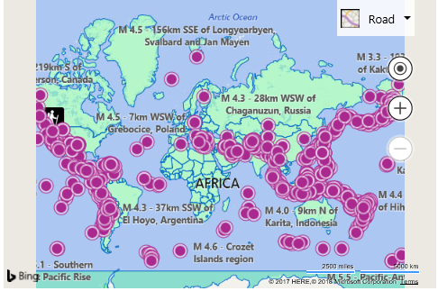

# IFrameable Configuration Map Example

A map configuration file can be loaded as a URL parameter of the Bing Maps configurable map page which can then be viewed in a browser as-is or embedded into a web app using an iframe. The Bing Maps configurable maps page URL has the following structure:

`https://www.bing.com/maps/configurable?config=[Encoded URL to your configuration file]`

Your configuration file URL must be encoded when added as a URL parameter to ensure the browser loads it correctly.

> [!NOTE]
> Your configuration file must be hosted on a publicly accessible endpoint and have CORS ([Cross-origin Resource Sharing](https://en.wikipedia.org/wiki/Cross-origin_resource_sharing)) enabled to allow for the JSON file to be loaded across domains. If storing your files in Azure storage, see the [Cross-Origin Resource Sharing (CORS) Support for the Azure Storage Services](https://docs.microsoft.com/azure/storage/common/storage-cors-support) documentation for details. 

A sample configuration file is hosted by the Bing Maps team here:

`https://bingmapsisdk.blob.core.windows.net/isdksamples/configmap2.json`

This can be loaded using the Bing Maps configurable maps page using the following URL:

`https://www.bing.com/maps/configurable?config=https%3A%2F%2Fbingmapsisdk.blob.core.windows.net%2Fisdksamples%2Fconfigmap2.json`

The following code loads the configurable map on a webpage using an iframe.

```html
<!DOCTYPE html>
<html>
<head>
    <meta charset="utf-8" />
    <title></title>
</head>
<body>
    <iframe src="https://www.bing.com/maps/configurable?config=https%3A%2F%2Fbingmapsisdk.blob.core.windows.net%2Fisdksamples%2Fconfigmap2.json" 
            style="width:600px;height:400px;" frameborder="0" scrolling="no"></iframe>
</body>
</html>
```

Here is a screenshot of the map that is rendered when loading this configuration file.



[Try it now](http://bingmapsv8samples.azurewebsites.net/#IFramable%20Configuration%20Map)
