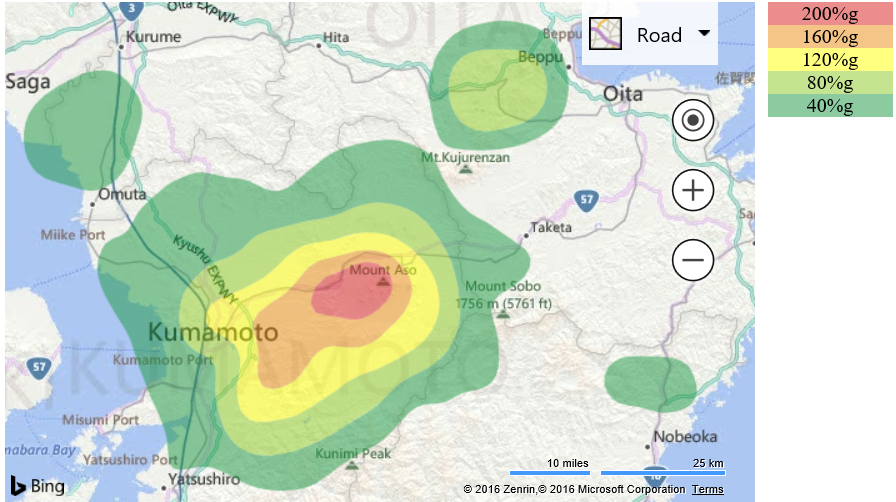

# Contours from GeoJSON data

This example downloads earthquake intensity contour data from the USGS for earthquake [M7.0 – 1km WSW of Kumamoto-shi, Japan](http://earthquake.usgs.gov/earthquakes/eventpage/us20005iis#executive). The contour areas are colored based on the intensity of the earthquake felt in that area.

```html
<!DOCTYPE html>
<html>
<head>
    <title></title>
    <meta charset="utf-8" />

    <script type='text/javascript'
            src='https://www.bing.com/api/maps/mapcontrol?callback=GetMap'
            async defer></script>

    <script type='text/javascript'>
    var map;

    //URL to the USGS for Earthquake intensity contours of M7.0 – 1km WSW of Kumamoto-shi, Japan.
    var earthquakeIntensityDataUrl = 'http://earthquake.usgs.gov/archive/product/shakemap/us20005iis/us/1467057010522/download/cont_psa03.json';

    function GetMap()
    {
        map = new Microsoft.Maps.Map('#myMap', {
            credentials: 'Your Bing Maps Key',
            center: new Microsoft.Maps.Location(32.944332, 131.074968),
            zoom: 9
        });
              

        //Load the Contour and GeoJson modules.
        Microsoft.Maps.loadModule(['Microsoft.Maps.Contour', 'Microsoft.Maps.GeoJson'], function () {
            //Download the contour data from the USGS. Downloading data directly as endpint does not support JSONP requests, but does support CORs.
            downloadData(earthquakeIntensityDataUrl, function (earthquakeData) {
                //Parse the GeoJson earthquake intensity contour data and create contour lines out of them.
                var data = Microsoft.Maps.GeoJson.read(earthquakeData);

                var contourLines = [];
                for (var i = 0; i < data.length; i++) {
                    contourLines.push(new Microsoft.Maps.ContourLine(data[i].getLocations(), data[i].metadata.value));
                }

                //Add the contour lines to a contour layer.
                var layer = new Microsoft.Maps.ContourLayer(contourLines, {
                    colorCallback: assignContourColor,
                    polygonOptions: {
                        //Make the outlines of the contour area transparent.
                        strokeColor: 'rgba(0, 0, 0, 0)'
                    }
                });

                //Add the contour layer to the map.
                map.layers.insert(layer);
            });           
        });
    }

    //A function that contains business logic that specifies which color to make a contour area based on it's value.
    function assignContourColor(value) {
        var color = 'rgba(25, 150, 65, 0.5)';

        if (value >= 200) {
            color = 'rgba(215, 25, 28, 0.5)';
        }
        else if (value >= 160) {
            color = 'rgba(235, 140, 14, 0.5)';
        }
        else if (value >= 120) {
            color = 'rgba(255, 255, 0, 0.5)';
        }
        else if (value >= 80) {
            color = 'rgba(140, 202, 32, 0.5)';
        }

        return color;
    }
        
    //A simple function that downloads data from a URL and passes it back though a callback function.
    function downloadData(url, callback) {
        var xhr = new XMLHttpRequest();
        xhr.open("GET", url, true);
        xhr.onreadystatechange = function (e) {
            if (xhr.readyState === 4) {
                callback(xhr.response);
            }
        };
        xhr.send();
    }
    </script>
    <style>
        .contourLegend {
            margin-left: 10px;
            float: left;
            text-align: center;
            width: 100px;
        }
    </style>
</head>
<body>
    <div id="myMap" style="position:relative;width:600px;height:400px;float:left;"></div>

    <div class="contourLegend">
        <div style="background-color: rgba(215, 25, 28, 0.5)">200%g</div>
        <div style="background-color: rgba(235, 140, 14, 0.5)">160%g</div>
        <div style="background-color: rgba(255, 255, 0, 0.5)">120%g</div>
        <div style="background-color: rgba(140, 202, 32, 0.5)">80%g</div>
        <div style="background-color: rgba(25, 150, 65, 0.5)">40%g</div>
    </div>
</body>
</html>
```

Running this code in a browser will display color code areas which represent the earthquake intensity measured in that area.



[Try it now](http://www.bing.com/api/maps/sdk/mapcontrol/isdk#contourLayerFromGeoJson+JS)
