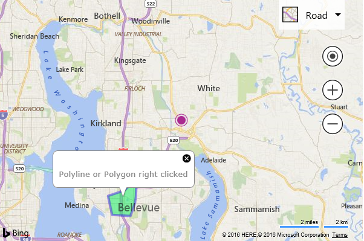

# Right Click Events for Shapes

Pushpins, polylines, and polygons support a number of mouse events, however right click is not one of them. However, the layer class does expose a right click event which will fire when a user right clicks and shape in the layer. This example shows how to use the right click event on a layer to trigger right click events on shapes.

```html
<!DOCTYPE html>
<html>
<head>
    <title></title>
    <meta charset="utf-8" />

    <script type='text/javascript'
            src='https://www.bing.com/api/maps/mapcontrol?callback=GetMap'
            async defer></script>

    <script type='text/javascript'>
        var map;
        var infobox;

    function GetMap() {
        map = new Microsoft.Maps.Map('#myMap', {
            credentials: 'Your Bing Maps Key'
        });

        //Add an infobox to the map so that we can display it when a shape is right clicked.
        infobox = new Microsoft.Maps.Infobox(map.getCenter(), { visible: false });
        infobox.setMap(map);

        //Create a layer.
        var layer = new Microsoft.Maps.Layer();

        //Add a pushpin to the layer.
        var pin = new Microsoft.Maps.Pushpin(map.getCenter());
        layer.add(pin);

        //Add a polygon to the layer.
        var polygon = Microsoft.Maps.TestDataGenerator.getPolygons(1, map.getBounds());
        layer.add(polygon);

        //Add layer to map.
        map.layers.insert(layer);

        //Add right click mouse event to the layer.
        Microsoft.Maps.Events.addHandler(layer, 'rightclick', function (e) {
            //Get the shape that the user right clicked on in the layer.
            var shape = e.primitive;

            var loc;
            var desc;

            //Depending on the type of shape that was clicked.
            if (shape instanceof Microsoft.Maps.Pushpin) {
                loc = shape.getLocation();
                desc = 'Pushpin right clicked';
            } else {
                loc = e.location;
                desc = 'Polyline or Polygon right clicked';
            }

            //Display the infobox with an unpdated location and description.
            infobox.setOptions({
                location: loc,
                description: desc,
                visible: true
            });
        });
    }
    </script>
</head>
<body>
    <div id="myMap" style="position:relative;width:600px;height:400px;"></div>
</body>
</html>
```

Running this code in a browser will display a map that has a pushpin and polygon rendered on it. If you right click either of these, an infobox will be displayed for that shape.

