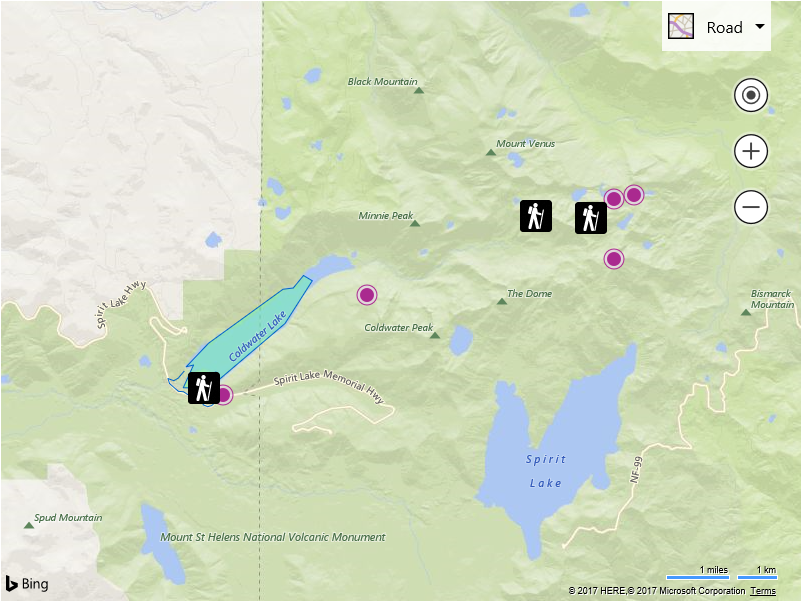

# Read Geospatial XML Files from Same Domain
This sample shows how to load a geospatial XML file that is hosted on the same domain as the application using a relative URL into a GeoXmlLayer. This sample will read in a sample GeoRSS file which you can find [here](http://bingmapsv8samples.azurewebsites.net/GeoXml/Data/GeoRSS/SampleGeoRss.xml) and render it on the map. 

```html
<!DOCTYPE html>
<html>
<head>
    <title></title>
    <meta charset="utf-8" />
    <script type='text/javascript'>
    var map, layer;
    var xmlUrl = 'SampleGeoRSS.xml';

    function GetMap() {
        map = new Microsoft.Maps.Map('#myMap', {
            credentials: 'Your Bing Maps Key',
            zoom: 1
        });

        //Load the GeoXml module.
        Microsoft.Maps.loadModule('Microsoft.Maps.GeoXml', function () {
            //Create an instance of the GeoXmlLayer and pass in the URL to the GeoRSS file that is hosted on the same domain.
            layer = new Microsoft.Maps.GeoXmlLayer(xmlUrl, true);

            //Add the layer to the map.
            map.layers.insert(layer);
        });
    }
    </script>
    <script type='text/javascript' src='https://www.bing.com/api/maps/mapcontrol?callback=GetMap' async defer></script>
</head>
<body>
    <div id="myMap" style="position:relative;width:800px;height:600px;"></div>
</body>
</html>
```

Running this sample (when you have the sample GeoRSS file) will load a map that looks like this.
 

 
[Try it now](http://bingmapsv8samples.azurewebsites.net/#GeoXmlLayer%20-%20Same%20Domain)

**Note:** Not all file and mime types are enabled in all servers. If using .NET, it is recommended to add the following to the web.config file:

```xml
<configuration>
  <system.webServer>
    <staticContent>
      <remove fileExtension=".json"/>
      <mimeMap fileExtension=".json" mimeType="application/json" />
      <mimeMap fileExtension=".geojson" mimeType="application/json" />
      <mimeMap fileExtension=".gpx" mimeType="application/xml" />
      <mimeMap fileExtension=".georss" mimeType="application/xml" />
      <mimeMap fileExtension=".kml" mimeType="application/vnd.google-earth.kml+xml" />
      <mimeMap fileExtension=".kmz" mimeType="application/vnd.google-earth.kmz" />
    </staticContent>
</configuration>
```