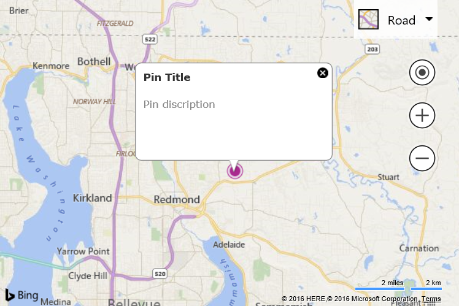

# Infobox when Pushpin Clicked
One of the most common scenarios where an infobox is displayed, is when a user clicks a pushpin. This example creates a pushpin at a random location on the map and stores some metadata for the pushpin with it. When the pushpin is clicked an infobox is opened and the title and description values are retrieved from the metadata stored in the pushpin. The location of the pushpin is also used to position the infobox. 

```
<!DOCTYPE html>
<html>
<head>
    <title></title>
    <meta charset="utf-8" />
	<script type='text/javascript'>
    var map, infobox;

    function GetMap() {
        map = new Microsoft.Maps.Map('#myMap', {});

        //Create an infobox at the center of the map but don't show it.
        infobox = new Microsoft.Maps.Infobox(map.getCenter(), {
            visible: false
        });

        //Assign the infobox to a map instance.
        infobox.setMap(map);

        //Create a pushpin at a random location in the map bounds.
        var randomLocation = Microsoft.Maps.TestDataGenerator.getLocations(1, map.getBounds());
        var pin = new Microsoft.Maps.Pushpin(randomLocation);

        //Store some metadata with the pushpin.
        pin.metadata = {
            title: 'Pin Title',
            description: 'Pin discription'
        };

        //Add a click event handler to the pushpin.
        Microsoft.Maps.Events.addHandler(pin, 'click', pushpinClicked);

        //Add pushpin to the map.
        map.entities.push(pin);
    }

    function pushpinClicked(e) {
        //Make sure the infobox has metadata to display.
        if (e.target.metadata) {
            //Set the infobox options with the metadata of the pushpin.
            infobox.setOptions({
                location: e.target.getLocation(),
                title: e.target.metadata.title,
                description: e.target.metadata.description,
                visible: true
            });
        }
    }
    </script>
    <script type='text/javascript' src='http://www.bing.com/api/maps/mapcontrol?callback=GetMap&key=[YOUR_BING_MAPS_KEY]' async defer></script>
</head>
<body>
    <div id="myMap" style="position:relative;width:600px;height:400px;"></div>
</body>
</html>
```

Running this code will display a pushpin on the map. If you click on it, an infobox will appear filled in with the metadata for that pushpin.

 

[Try it now](https://www.bing.com/api/maps/sdk/mapcontrol/isdk#displayInfoboxOnClickPushpin+JS)