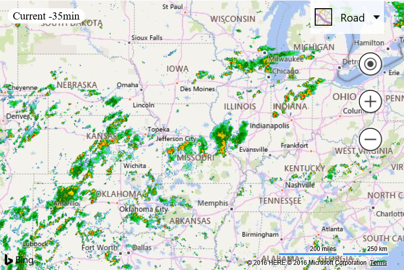

# AnimatedTileLayer Events
This example uses the `onFrameLoaded` event of the [AnimatedTileLayer](../../map-control-api/animatedtilelayer-class.md) class to update a message about the currently display tile layer in the animation. For this example the weather radar tile service from the [Iowa Environmental Mesonet of Iowa State University](http://www.mesonet.agron.iastate.edu/ogc/) and animates it. This service provides radar images for the last 50 minutes over the USA broken up into 5 minute increments. 

```
<!DOCTYPE html>
<html>
<head>
    <title></title>
    <meta charset="utf-8" />
	<script type='text/javascript'>
    var map, animatedLayer;

    //Weather tile url from Iowa Environmental Mesonet (IEM): http://mesonet.agron.iastate.edu/ogc/
    var urlTemplate = 'http://mesonet.agron.iastate.edu/cache/tile.py/1.0.0/nexrad-n0q-{timestamp}/{zoom}/{x}/{y}.png';

    //The time stamps values for the IEM service for the last 50 minutes broken up into 5 minute increments.
    var timestamps = ['900913-m50m', '900913-m45m', '900913-m40m', '900913-m35m', '900913-m30m', '900913-m25m', '900913-m20m', '900913-m15m', '900913-m10m', '900913-m05m', '900913'];
    var displayMessages = [];

    function GetMap()
    {
        map = new Microsoft.Maps.Map('#myMap', {
            credentials: 'Your Bing Maps Key',
            center: new Microsoft.Maps.Location(39, -92),
            zoom: 5
        });

        var tileSources = [];

        //Create a tile source for each time stamp.
        for (var i = 0; i < timestamps.length; i++) {
            var tileSource = new Microsoft.Maps.TileSource({
                uriConstructor: urlTemplate.replace('{timestamp}', timestamps[i])
            });
            tileSources.push(tileSource);

            //Create a message to display for each frame of the animation based on the time stamp.
            var msg = 'Current';

            if (timestamps[i] != '900913') {
                msg += ' -' + timestamps[i].replace('900913-m', '') + 'in';
            }

            displayMessages.push(msg);
        }

        //Create the animated tile layer and add it to the map.
        animatedLayer = new Microsoft.Maps.AnimatedTileLayer({
            mercator: tileSources,
            frameRate: 500
        });

        //Add an event handler that fires for each frame of the animation.
        Microsoft.Maps.Events.addHandler(animatedLayer, 'onFrameLoaded', function (e) {
            var msg = displayMessages[e.index];
            document.getElementById('messagePanel').innerText = msg;
        });

        map.layers.insert(animatedLayer);
    }
    </script>
    <style>
        #messagePanel{
            position:absolute;
            top:20px;
            left:20px;
            background-color:white;
            padding:2px;
            border-radius:15px;
            width:110px;
            text-align:center;
        }
    </style>
    <script type='text/javascript' src='http://www.bing.com/api/maps/mapcontrol?callback=GetMap' async defer></script>
</head>
<body>
    <div id="myMap" style="position:relative;width:600px;height:400px;"></div>
    <div id="messagePanel"></div>
</body>
</html>
```

Running this code will display a map that is animating through weather radar tile layers. With each frame of the animation a message is displayed in the top left corner of the map related to the time stamp for the currently displayed tile layer frame. 


