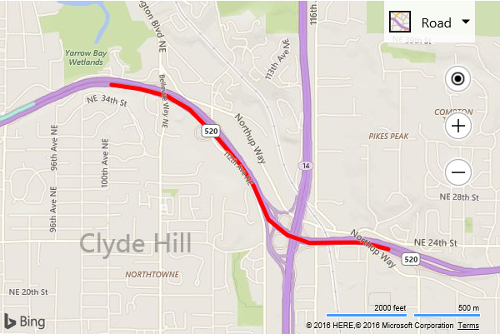

# Point Compression Example
## Related Topics

* [PointCompression Class](../map-control-api/pointcompression-class.md)

## Example

In this example the encoded string “x90uhio4sQmhuGwxrGz8sGp-zP5ooKpx9Eiz7Ip2vFko8E56xEl-zEyhkG” is decoded into an array of Locations. The array of locations is then displayed on the map as a Polyline and map view set accordingly so that we can see what it looks like. To demonstrate and verify the encoding/decoding logic this example then encodes the Locations and compares the two strings to ensure they are the same.

```html
<!DOCTYPE html>
<html>
<head>
    <title></title>
    <meta charset="utf-8" />
	<script type='text/javascript'>
    function GetMap() {
        var map = new Microsoft.Maps.Map('#myMap', {
            credentials: ‘Your Bing Maps Key’
        });

        var encodedString = 'x90uhio4sQmhuGwxrGz8sGp-zP5ooKpx9Eiz7Ip2vFko8E56xEl-zEyhkG';

        //Decode the encoded string.
        var locs = Microsoft.Maps.PointCompression.decode(encodedString);

        //Display the locations as a polyline on the map so we can see what it looks like.
        var p = new Microsoft.Maps.Polyline(locs, {
            strokeColor: 'red',
            strokeThickness: 5
        });
        map.entities.push(p);

        //Set the view of the map over the polyline.
        map.setView({ bounds: Microsoft.Maps.LocationRect.fromLocations(locs) });

        //Encode the locations.
        var newEncodedString = Microsoft.Maps.PointCompression.encode(locs);

        //Verify that the encoded string and new encoded string match.
        if (encodedString === newEncodedString) {
            alert('Correctly encoded locations.');
        } else {
            alert('Incorrectly encoded locations.');
        }
    }
    </script>
    <script type='text/javascript' src='http://www.bing.com/api/maps/mapcontrol?callback=GetMap' async defer></script>
</head>
<body>
    <div id="myMap" style="position:relative;width:600px;height:400px;"></div>
</body>
</html>
```

Running this code will display a Polyline, that is derived from the provided encoded string, on to of the map. In this case it represents a section of the 520 highway in Bellevue, WA.



[Try it now](http://www.bing.com/api/maps/sdk/mapcontrol/isdk#decodeCompressedString+JS)