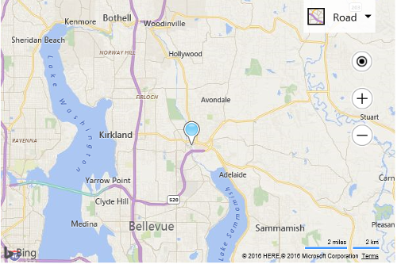

# Custom Image Pushpin Example
The default pushpin icon is great, but at some point you may want to change this to a different icon. To do this, you can pass a URL of a custom image into the `icon` property of the pushpin options. Let's say you have the following image in the images folder of your web application: 

 poi_custom.png

You can use the following code to create a pushpin using the image of the sun. An anchor is used to specify what part of the image should be anchored to the location of the pushpin. In this example, we are using an anchor that is the approximate center of the image – 22 pixels from the left and 16 pixels from the top. If an anchor isn't specified, the anchor of the default pushpin will be used. If your image is either a different size or is meant to be anchored in a different place on the image when compared to the default pushpin, you will likely find that it appears as if the pushpin is moving away from the location as users zoom in on the map.  See more about this via the [Anchoring Pushpins](anchoring-pushpins.md) topic.

```
<!DOCTYPE html>
<html>
<head>
    <title></title>
    <meta charset="utf-8" />
	<script type='text/javascript'>
    function GetMap() {
        var map = new Microsoft.Maps.Map('#myMap',
        {});

        var center = map.getCenter();

        //Create custom Pushpin
        var pin = new Microsoft.Maps.Pushpin(center, {
            icon: 'images/poi_custom.png',
            anchor: new Microsoft.Maps.Point(12, 39)
        });

        //Add the pushpin to the map
        map.entities.push(pin);
    }
    </script>
    <script type='text/javascript' src='http://www.bing.com/api/maps/mapcontrol?callback=GetMap&key=[YOUR_BING_MAPS_KEY]' async defer></script>
</head>
<body>
    <div id="myMap" style="position:relative;width:600px;height:400px;"></div>
</body>
</html>
```

Here is what this pushpin looks like on the map. 



[Try it now](https://www.bing.com/api/maps/sdk/mapcontrol/isdk#createPushpinFromImage+JS)