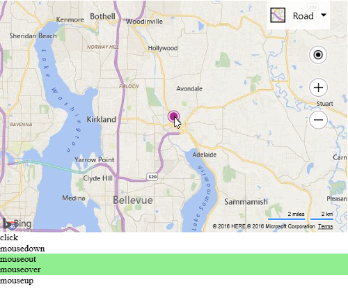

# Pushpin Events Example

In many applications simply viewing pushpins isn't enough, you need to interact with them too. Attaching events to pushpins allow you to interact with pushpins using a mouse our touch device.

This example attaches several mouse events to a pushpin. When these events are triggered they highlight a label to indicate which event fired. 

```html
<!DOCTYPE html>
<html>
<head>
    <title></title>
    <meta charset="utf-8" />
	<script type='text/javascript'>
    var map;

    function GetMap() {
        map = new Microsoft.Maps.Map('#myMap', {});

        //Create a pushpin.
        var pushpin = new Microsoft.Maps.Pushpin(map.getCenter());
        map.entities.push(pushpin);

        //Add mouse events to the pushpin.
        Microsoft.Maps.Events.addHandler(pushpin, 'click', function () { highlight('pushpinClick'); });
        Microsoft.Maps.Events.addHandler(pushpin, 'mousedown', function () { highlight('pushpinMousedown'); });
        Microsoft.Maps.Events.addHandler(pushpin, 'mouseout', function () { highlight('pushpinMouseout'); });
        Microsoft.Maps.Events.addHandler(pushpin, 'mouseover', function () { highlight('pushpinMouseover'); });
        Microsoft.Maps.Events.addHandler(pushpin, 'mouseup', function () { highlight('pushpinMouseup'); });
    }

    function highlight(id) {
        //Highlight the mouse event div to indicate that the event has fired.
        document.getElementById(id).style.background = 'LightGreen';

        //Remove the highlighting after a second.
        setTimeout(function () { document.getElementById(id).style.background = 'white'; }, 1000);
    }
    </script>
    <script type='text/javascript' src='http://www.bing.com/api/maps/mapcontrol?callback=GetMap&key=[YOUR_BING_MAPS_KEY]' async defer></script>
</head>
<body>
    <div id="myMap" style="position:relative;width:800px;height:600px;"></div>

    <div id="pushpinClick">click</div>
    <div id="pushpinMousedown">mousedown</div>
    <div id="pushpinMouseout">mouseout</div>
    <div id="pushpinMouseover">mouseover</div>
    <div id="pushpinMouseup">mouseup</div>
</body>
</html>
```

If you run this code and hover and click the pushpin you will see all these different events fire.



[Try it now](https://www.bing.com/api/maps/sdk/mapcontrol/isdk#pushpinAllEvents+HTML)