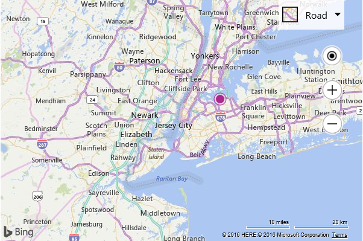

# Basic Geocode Example
The following code sample shows how to make a geocode request using the Search module. This code loads the search module if it isn’t already loaded, geocodes “New York, NY”, adds a pushpin to that location, and sets the map view over the result.

```
<!DOCTYPE html>
<html>
<head>
    <title></title>
    <meta charset="utf-8" />
    <script type='text/javascript'>
    var map, searchManager;

    function GetMap() {
        map = new Microsoft.Maps.Map('#myMap', {
            credentials: 'Your Bing Maps Key'
        });

        //Make a request to geocode New York, NY.
        geocodeQuery("New York, NY");
    }

    function geocodeQuery(query) {
        //If search manager is not defined, load the search module.
        if (!searchManager) {
            //Create an instance of the search manager and call the geocodeQuery function again.
            Microsoft.Maps.loadModule('Microsoft.Maps.Search', function () {
                searchManager = new Microsoft.Maps.Search.SearchManager(map);
                geocodeQuery(query);
            });
        } else {
            var searchRequest = {
                where: query,
                callback: function (r) {
                    //Add the first result to the map and zoom into it.
                    if (r && r.results && r.results.length > 0) {
                        var pin = new Microsoft.Maps.Pushpin(r.results[0].location);
                        map.entities.push(pin);

                        map.setView({ bounds: r.results[0].bestView });
                    }
                },
                errorCallback: function (e) {
                    //If there is an error, alert the user about it.
                    alert("No results found.");
                }
            };

            //Make the geocode request.
            searchManager.geocode(searchRequest);
        }
    }
    </script>
    <script type='text/javascript' src='http://www.bing.com/api/maps/mapcontrol?callback=GetMap' async defer></script>
</head>
<body>
    <div id="myMap" style="position:relative;width:600px;height:400px;"></div>
</body>
</html>
```

Here is what the resulting map looks like.



[Try it now](https://bingmapsv8samples.azurewebsites.net/#Geocode)
