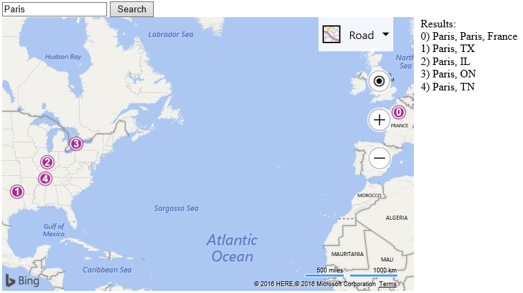

# User Input Geocode Example

This code sample displays a search textbox and button long with a map. When the user types in a query and presses the search button a check is done to see if the Search module is loaded. If it is loaded, the users query is then geocoded. The results are displayed on the map and a list of the result names are shown beside the map.

> [!TIP]
> In this code example the search module isn’t loaded when the map is loaded, but instead is delayed until the user actually presses the search button. This is a great way to minimize the initial page load such that resources are only loaded when they are actually needed.

```html
<!DOCTYPE html>
<html>
<head>
    <title></title>
    <meta charset="utf-8" />
    <script type='text/javascript'>
    var map, searchManager;

    function GetMap() {
        map = new Microsoft.Maps.Map('#myMap', {
            credentials: 'Your Bing Maps Key'
        });
    }

    function Search() {
        if (!searchManager) {
            //Create an instance of the search manager and perform the search.
            Microsoft.Maps.loadModule('Microsoft.Maps.Search', function () {
                searchManager = new Microsoft.Maps.Search.SearchManager(map);
                Search()
            });
        } else {
            //Remove any previous results from the map.
            map.entities.clear();

            //Get the users query and geocode it.
            var query = document.getElementById('searchTbx').value;
            geocodeQuery(query);
        }
    }

    function geocodeQuery(query) {
        var searchRequest = {
            where: query,
            callback: function (r) {
                if (r && r.results && r.results.length > 0) {
                    var pin, pins = [], locs = [], output = 'Results:<br/>';

                    for (var i = 0; i < r.results.length; i++) {
                        //Create a pushpin for each result. 
                        pin = new Microsoft.Maps.Pushpin(r.results[i].location, {
                            text: i + ''
                        });
                        pins.push(pin);
                        locs.push(r.results[i].location);

                        output += i + ') ' + r.results[i].name + '<br/>';
                    }

                    //Add the pins to the map
                    map.entities.push(pins);

                    //Display list of results
                    document.getElementById('output').innerHTML = output;

                    //Determine a bounding box to best view the results.
                    var bounds;

                    if (r.results.length == 1) {
                        bounds = r.results[0].bestView;
                    } else {
                        //Use the locations from the results to calculate a bounding box.
                        bounds = Microsoft.Maps.LocationRect.fromLocations(locs);
                    }

                    map.setView({ bounds: bounds });
                }
            },
            errorCallback: function (e) {
                //If there is an error, alert the user about it.
                alert("No results found.");
            }
        };

        //Make the geocode request.
        searchManager.geocode(searchRequest);
    }
    </script>
    <script type='text/javascript' src='http://www.bing.com/api/maps/mapcontrol?callback=GetMap' async defer></script>
</head>
<body>
    <input id='searchTbx' type='text'/>
    <input type='button'value='Search' onclick='Search()'/>
    <br/>
    <div id="myMap" style="position:relative;width:600px;height:400px;float:left;"></div>
    <div id='output' style="margin-left:10px;float:left;"></div>
</body>
</html>
```
Here is what this looks like when you do a search for “Paris”. 



[Try it now](https://bingmapsv8samples.azurewebsites.net/#Geocode_SearchResults)