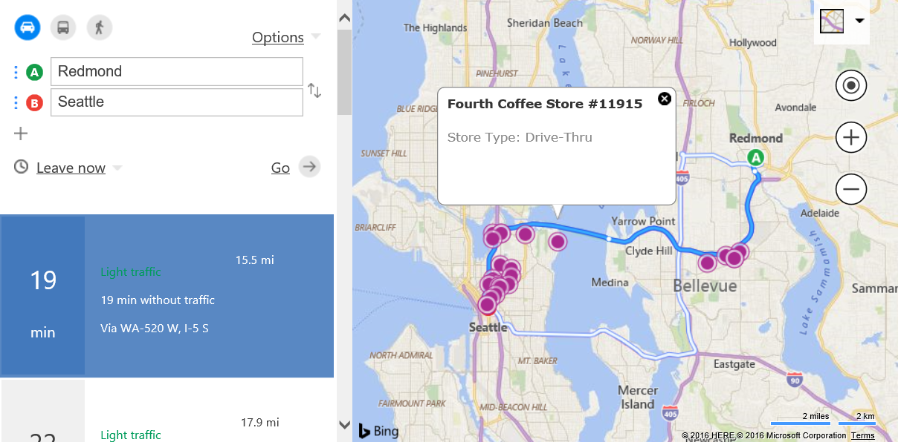

# Along a Route Search
This example shows how to search for locations along a route. It uses the built-in direction input panel and the Fourth Coffee Sample data source to search for coffee shops that are along a route.

```html
<!DOCTYPE html>
<html>
<head>
    <title></title>
    <meta charset="utf-8" />
	<script type='text/javascript'>
        var map, infobox, dataLayer, directionsManager;

        //Query URL to the Fourth Coffe Shop data source
        var sdsDataSourceUrl = 'http://spatial.virtualearth.net/REST/v1/data/20181f26d9e94c81acdf9496133d4f23/FourthCoffeeSample/FourthCoffeeShops';

        function GetMap()
        {
            map = new Microsoft.Maps.Map('#myMap', {});

            //Create a layer for rendering the data that is along a route.
            dataLayer = new Microsoft.Maps.Layer();

            //Add the layer to the map.
            map.layers.insert(dataLayer);

            //Add click event to shapes in the data layer.
            Microsoft.Maps.Events.addHandler(dataLayer, 'click', shapeClicked);

            //Create an infobox at the center of the map but don't show it.
            infobox = new Microsoft.Maps.Infobox(map.getCenter(), {
                visible: false
            });

            //Assign the infobox to a map instance.
            infobox.setMap(map);

            //Load the directions and spatial data service modules.
            Microsoft.Maps.loadModule(['Microsoft.Maps.Directions', 'Microsoft.Maps.SpatialDataService'], function () {
                //Create an instance of the directions manager.
                directionsManager = new Microsoft.Maps.Directions.DirectionsManager(map);

                //Specify where to display the route instructions.
                directionsManager.setRenderOptions({ itineraryContainer: '#directionsItinerary' });

                //Specify the where to display the input panel
                directionsManager.showInputPanel('directionsPanel');

                //Add event handler to directions manager.
                Microsoft.Maps.Events.addHandler(directionsManager, 'directionsUpdated', directionsUpdated);
            });
        }

        function directionsUpdated(e) {
            dataLayer.clear();

            var currentRoute = directionsManager.getCurrentRoute();

            if (!currentRoute) {
                alert('No route found.');
                return;
            }

            var routeRequest = directionsManager.getRequestOptions();

            var routeMode = getRouteMode(routeRequest);

            if(!routeMode){
                alert('Transit mode is not supported for near route queries.');
                return;
            }

            //Create a query to get nearby data.
            var queryOptions = {
                queryUrl: sdsDataSourceUrl,
                spatialFilter: {
                    spatialFilterType: 'nearRoute',
                    start: currentRoute.routeLegs[0].startWaypointLocation,
                    end: currentRoute.routeLegs[0].endWaypointLocation,
                    travelMode: getRouteMode(routeRequest),
                    optimize: getRouteOptimization(routeRequest)
                }
            };

            //Process the query.
            Microsoft.Maps.SpatialDataService.QueryAPIManager.search(queryOptions, map, function (data) {
                //Add results to the map.
                dataLayer.add(data);
            });
        }

        function getRouteMode(routeRequest) {
            switch(routeRequest.routeMode){
                case Microsoft.Maps.Directions.RouteMode.driving:
                    return 'Driving';
                case Microsoft.Maps.Directions.RouteMode[routeRequest.routeMode].walking:
                    return 'Walking';
            }

            return null;
        }

        function getRouteOptimization(routeRequest) {
            switch(routeRequest.routeOptimize){
                case Microsoft.Maps.Directions.RouteOptimization.timeWithTraffic:
                    return 'timeWithTraffic';
                case Microsoft.Maps.Directions.RouteOptimization.shortestDistance:
                    return 'distance';
                case Microsoft.Maps.Directions.RouteOptimization.shortestTime:
                default:
                    return 'time';
            }
        }

        function shapeClicked(e) {
            //Make sure the infobox has metadata to display.
            if (e.primitive.metadata) {
                //Set the infobox options with the metadata of the pushpin.
                infobox.setOptions({
                    location: e.primitive.getLocation(),
                    title: e.primitive.metadata.Name,
                    description: 'Store Type: ' + e.primitive.metadata.StoreType,
                    visible: true
                });
            }
        }
    </script>
    <style>
        html, body {
            padding: 0;
            margin: 0;
            height: 100%;
        }

        .directionsContainer {
            width: 380px;
            height: 100%;
            overflow-y: auto;
            float: left;
        }

        #myMap {
            position: relative;
            width: calc(100% - 380px);
            height: 100%;
            float: left;
        }
    </style>
    <script type='text/javascript' src='http://www.bing.com/api/maps/mapcontrol?callback=GetMap&key=[YOUR_BING_MAPS_KEY]' async defer></script>
</head>
<body>
    <div class="directionsContainer">
        <div id="directionsPanel"></div>
        <div id="directionsItinerary"></div>
    </div>
    <div id="myMap"></div>
</body>
</html>
```

Running this code will display a map and the directions input panel. Calculating a route from "Redmond, WA" to "Seattle, WA" will display a route on the map and nearby coffee shops. Clicking on a coffee shop will show the name of the coffee shop and the type of store it is.

 
