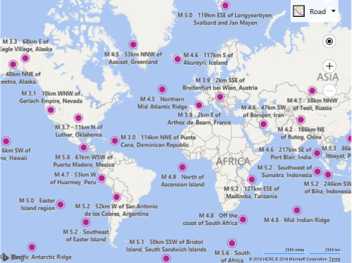

# Read GeoJSON from the Web using JSONP Example
In this example we will use the USGS Earthquake REST service to load in recent earthquakes from around the world. This REST service is documented [here](http://earthquake.usgs.gov/fdsnws/event/1/) and supports returning data in GeoJSON format. It also supports JSONP for cross domain requests. The name of the URL parameter used for JSONP requests in this service is “callback”.  

```
<!DOCTYPE html>
<html>
<head>
    <title></title>
    <meta charset="utf-8" />
	<script type='text/javascript'>
    var usgsEarthquakeUrl = 'http://earthquake.usgs.gov/fdsnws/event/1/query?minmagnitude=3&format=geojson';

    function GetMap() {
        var map = new Microsoft.Maps.Map('#myMap', {
            credentials: ‘Your Bing Maps Key’
        });

        Microsoft.Maps.loadModule('Microsoft.Maps.GeoJson', function () {

            Microsoft.Maps.GeoJson.readFromUrl(usgsEarthquakeUrl,
                function (shapes) {
                    //Add the shape(s) to the map.
                    map.entities.push(shapes);
                }, 'callback');
        });
    }
    </script>
    <script type='text/javascript' src='http://www.bing.com/api/maps/mapcontrol?callback=GetMap' async defer></script>
</head>
<body>
    <div id="myMap" style="position:relative;width:1200px;height:800px;"></div>
</body>
</html>
```

When you run this code, you should see a large number of pushpins showing where earthquakes have occurred over the past 30 days with a magnitude of 3 or higher.



[Try it now](http://www.bing.com/api/maps/sdk/mapcontrol/isdk#geoJsonReadExternal+JS)