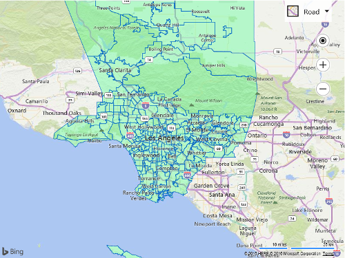

# Read GeoJSON using HTML5 FileReader
This code examples shows how to enable drag and drop a local GeoJSON file onto a map. To accomplish this, the FileReader and Drag & Drop API’s that are available in HTML5 are used. Good documentation on how to use these API’s together can be found [here](http://www.html5rocks.com/en/tutorials/file/dndfiles/#toc-selecting-files-dnd). This code will allow one or more GeoJSON files to be dropped and rendered onto the map.

```
<!DOCTYPE html>
<html>
<head>
    <title></title>
    <meta charset="utf-8" />
    <script type='text/javascript' 
            src='www.bing.com/api/maps/mapcontrol?callback=GetMap' 
            async defer></script>
    <script type='text/javascript'>
    var map;

    function GetMap() {
        map = new Microsoft.Maps.Map('#myMap', {
            credentials: ‘Your Bing Maps Key’
        });

        //Load the GeoJSON module.
        Microsoft.Maps.loadModule('Microsoft.Maps.GeoJson', function () {

            //Setup the drag & drop listeners on the map.
            var dropZone = document.getElementById('myMap');
            dropZone.addEventListener('dragover', handleDragOver, false);
            dropZone.addEventListener('drop', handleFileSelect, false);
        });
    }

    function handleDragOver(evt) {
        //Stop the browser from performing its default 
        //behavior when a file is drag and dropped.
        evt.stopPropagation();
        evt.preventDefault();

        evt.dataTransfer.dropEffect = 'copy';
    }

    function handleFileSelect(evt) {
        //Stop the browser from performing its default 
        //behavior when a file is drag and dropped.
        evt.stopPropagation();
        evt.preventDefault();

        //Remove any existing data from the map
        myMap.entities.clear();

        //The list of files that have been dragged and dropped onto the map.
        var files = evt.dataTransfer.files; 

        //Loop through and attempt to read each file. 
        for (var i = 0; i < files.length; i++) {
            var reader = new FileReader();

            reader.onload = function (e) {
                try {
                    var geoJsonText = e.target.result;

                    //Attempt to parse the file as GeoJSON and add the shapes to the map.
                    var shapes = Microsoft.Maps.GeoJson.read(geoJsonText);
                    myMap.entities.push(shapes);
                } catch (e) {
                    alert('Unable to read file as GeoJSON.');
                }
            };

            //Read the file as text.
            reader.readAsText(files[i]);
        }
    }  
    </script>
</head>
<body>
    <div id="myMap" style="position:relative;width:800px;height:600px;"></div>
</body>
</html>
```

The following image shows the neighborhood boundaries of Los Angeles that came from a GeoJSON file that was downloaded from the [Los Angeles Times Boundaries API](http://boundaries.latimes.com/sets/).

