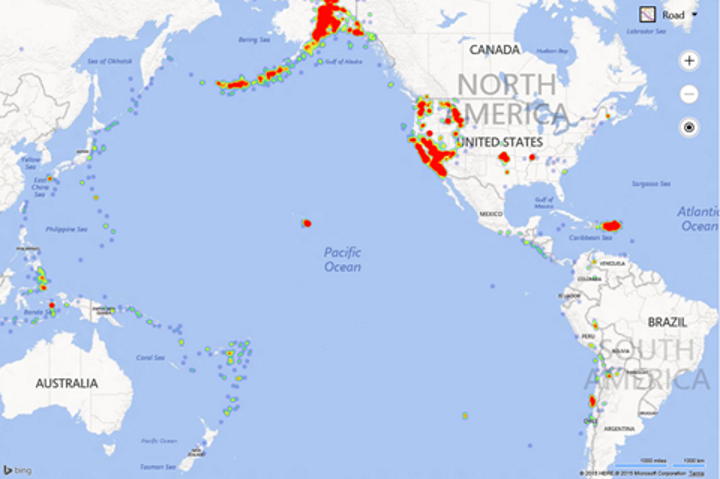

# Render GeoJSON as Heat Map
This code sample loads in earthquake data for the last 30 days from the United States Geological Survey (USGS) and displays them as a heatmap layer. The USGS data makes a number of earthquake data feeds available in GeoJSON format on their website [here](http://earthquake.usgs.gov/earthquakes/feed/v1.0/geojson.php). 

```
<!DOCTYPE html>
<html>
<head>
    <title></title>
    <meta charset="utf-8" />
    <script type='text/javascript' src='http://www.bing.com/api/maps/mapcontrol?callback=GetMap' 
            async defer></script>
    <script type='text/javascript'>
    var usgsEarthquakeUrl = ' http://earthquake.usgs.gov/earthquakes/feed/v1.0/summary/all_month.geojson';

    function GetMap() {
        var map = new Microsoft.Maps.Map('#myMap', {
            credentials: ‘Your Bing Maps Key’,
            center: new Microsoft.Maps.Location(40, -120),
            zoom: 2
        });

        //Load the GeoJSON and HeatMap modules.
        Microsoft.Maps.loadModule(['Microsoft.Maps.GeoJson', 'Microsoft.Maps.HeatMap'], function () {
            Microsoft.Maps.GeoJson.readFromUrl(usgsEarthquakeUrl, function (shapes) {
                var heatmap = new Microsoft.Maps.HeatMapLayer(shapes, { radius: 5 });
                map.layers.insert(heatmap);
            });
        });
    }
    </script>
</head>
<body>
    <div id="myMap" style="position:relative;width:600px;height:400px;"></div>
</body>
</html>
```

Here is what this heat map looks like over the Pacific Ocean which is surrounded by the [Ring of Fire](https://en.wikipedia.org/wiki/Ring_of_Fire), an area where a large number of earthquakes and volcanic eruptions occur. 



[Try it now](http://www.bing.com/api/maps/sdk/mapcontrol/isdk#heatMapFromGeoJson+JS)