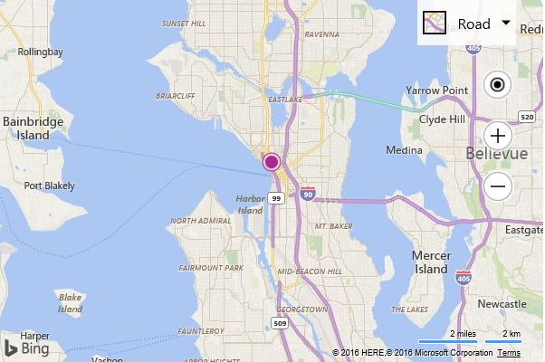

# Well Known Text Read Example
This example shows how to parse a Well Known Text string value into a Bing Maps shape and display it on the map.

```
<!DOCTYPE html>
<html>
<head>
    <title></title>
    <meta charset="utf-8" />
	<script type='text/javascript'>
    function GetMap() {
        var map = new Microsoft.Maps.Map('#myMap', {
            credentials: 'Your Bing Maps Key',
            center: new Microsoft.Maps.Location(47.6, -122.34)
        });

        //Load the Well Known Text module.
        Microsoft.Maps.loadModule('Microsoft.Maps.WellKnownText', function () {
            //Parse well known text string.
            var pin = Microsoft.Maps.WellKnownText.read('POINT(-122.34009 47.60995)');

            //Add parsed shape to the map.
            map.entities.push(pin);
        });
    }
    </script>
    <script type='text/javascript' src='http://www.bing.com/api/maps/mapcontrol?callback=GetMap' async defer></script>
</head>
<body>
    <div id="myMap" style="position:relative;width:600px;height:400px;"></div>
</body>
</html>
```

Running this code will load a map and display a pushpin at the coordinates (47.60995, -122.34009).



[Try it now](http://www.bing.com/api/maps/sdk/mapcontrol/isdk#wktAddPoint+JS)